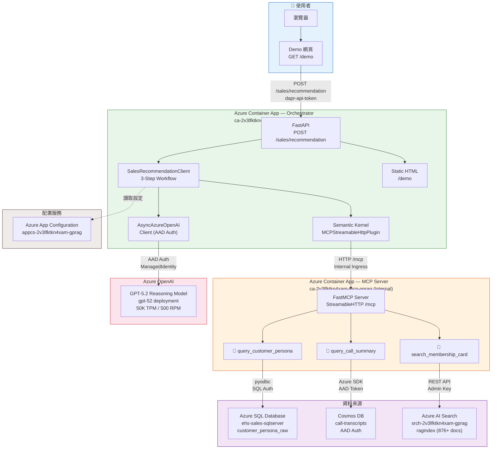

# 東森購物 AI 電銷推薦系統 — 系統架構圖

```mermaid
graph TB
    subgraph User["👤 使用者"]
        DemoPage["Demo 網頁<br/>GET /demo"]
        Browser["瀏覽器"]
    end

    subgraph ACA_Orch["Azure Container App — Orchestrator<br/>ca-2v3lfktkn4xam-orch-gprag (External)"]
        FastAPI["FastAPI<br/>POST /sales/recommendation"]
        SalesRec["SalesRecommendationClient<br/>3-Step Workflow"]
        MCPPlugin["Semantic Kernel<br/>MCPStreamableHttpPlugin"]
        OAIClient["AsyncAzureOpenAI<br/>Client (AAD Auth)"]
        StaticPage["Static HTML<br/>/demo"]
    end

    subgraph ACA_MCP["Azure Container App — MCP Server<br/>ca-2v3lfktkn4xam-mcp-gprag (Internal)"]
        MCPServer["FastMCP Server<br/>StreamableHTTP /mcp"]
        Tool1["🔧 query_customer_persona"]
        Tool2["🔧 query_call_summary"]
        Tool3["🔧 search_membership_card"]
    end

    subgraph DataSources["資料來源"]
        SQL["Azure SQL Database<br/>ehs-sales-sqlserver<br/>customer_persona_raw"]
        Cosmos["Cosmos DB<br/>call-transcripts<br/>AAD Auth"]
        AISearch["Azure AI Search<br/>srch-2v3lfktkn4xam-gprag<br/>ragindex (876+ docs)"]
    end

    subgraph AI["Azure OpenAI"]
        GPT52["GPT-5.2 Reasoning Model<br/>gpt-52 deployment<br/>50K TPM / 500 RPM"]
    end

    subgraph Config["配置服務"]
        AppConfig["Azure App Configuration<br/>appcs-2v3lfktkn4xam-gprag"]
    end

    Browser --> DemoPage
    DemoPage -->|"POST /sales/recommendation<br/>dapr-api-token"| FastAPI
    FastAPI --> SalesRec
    SalesRec --> MCPPlugin
    SalesRec --> OAIClient
    FastAPI --> StaticPage

    MCPPlugin -->|"HTTP /mcp<br/>Internal Ingress"| MCPServer
    MCPServer --> Tool1
    MCPServer --> Tool2
    MCPServer --> Tool3

    Tool1 -->|"pyodbc<br/>SQL Auth"| SQL
    Tool2 -->|"Azure SDK<br/>AAD Token"| Cosmos
    Tool3 -->|"REST API<br/>Admin Key"| AISearch

    OAIClient -->|"AAD Auth<br/>ManagedIdentity"| GPT52

    SalesRec -.->|"讀取設定"| AppConfig

    style User fill:#e3f2fd,stroke:#1565c0
    style ACA_Orch fill:#e8f5e9,stroke:#2e7d32
    style ACA_MCP fill:#fff3e0,stroke:#e65100
    style DataSources fill:#f3e5f5,stroke:#6a1b9a
    style AI fill:#fce4ec,stroke:#c62828
    style Config fill:#efebe9,stroke:#4e342e
```
