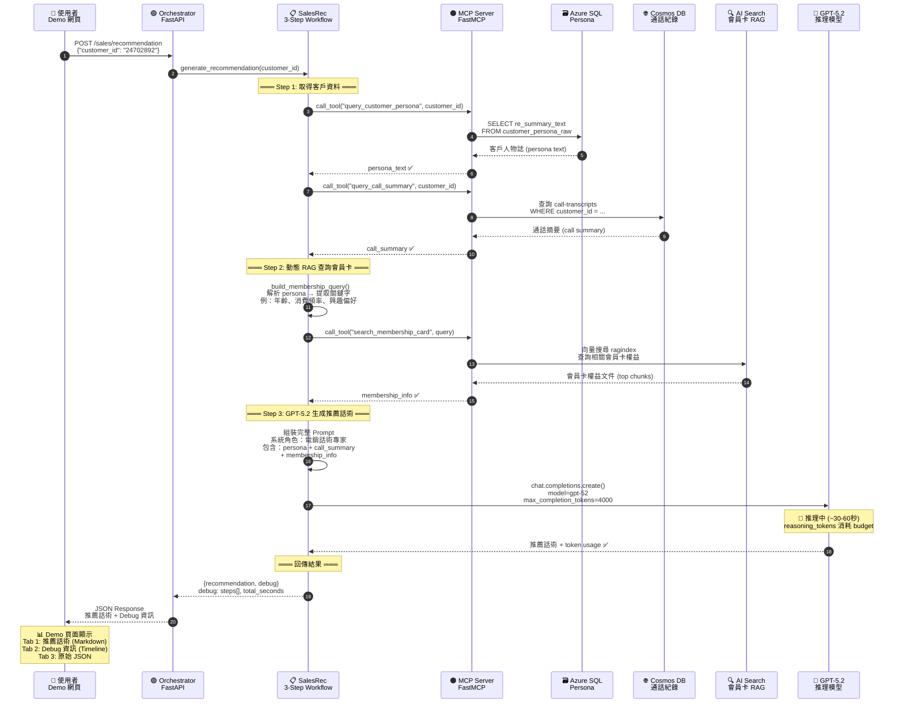

# 東森購物 AI 電銷推薦系統 — 流程圖

```mermaid
sequenceDiagram
    autonumber
    participant U as 👤 使用者<br/>Demo 網頁
    participant O as 🟢 Orchestrator<br/>FastAPI
    participant S as 📋 SalesRec<br/>3-Step Workflow
    participant MCP as 🟠 MCP Server<br/>FastMCP
    participant SQL as 🗃️ Azure SQL<br/>Persona
    participant CDB as 🌐 Cosmos DB<br/>通話紀錄
    participant AIS as 🔍 AI Search<br/>會員卡 RAG
    participant GPT as 🧠 GPT-5.2<br/>推理模型

    U->>O: POST /sales/recommendation<br/>{"customer_id": "24702892"}
    O->>S: generate_recommendation(customer_id)
    
    Note over S: ═══ Step 1: 取得客戶資料 ═══
    
    S->>MCP: call_tool("query_customer_persona", customer_id)
    MCP->>SQL: SELECT re_summary_text<br/>FROM customer_persona_raw
    SQL-->>MCP: 客戶人物誌 (persona text)
    MCP-->>S: persona_text ✅

    S->>MCP: call_tool("query_call_summary", customer_id)
    MCP->>CDB: 查詢 call-transcripts<br/>WHERE customer_id = ...
    CDB-->>MCP: 通話摘要 (call summary)
    MCP-->>S: call_summary ✅

    Note over S: ═══ Step 2: 動態 RAG 查詢會員卡 ═══

    S->>S: _build_membership_query()<br/>解析 persona → 提取關鍵字<br/>例：年齡、消費頻率、興趣偏好
    S->>MCP: call_tool("search_membership_card", query)
    MCP->>AIS: 向量搜尋 ragindex<br/>查詢相關會員卡權益
    AIS-->>MCP: 會員卡權益文件 (top chunks)
    MCP-->>S: membership_info ✅

    Note over S: ═══ Step 3: GPT-5.2 生成推薦話術 ═══

    S->>S: 組裝完整 Prompt<br/>系統角色：電銷話術專家<br/>包含：persona + call_summary<br/>+ membership_info
    S->>GPT: chat.completions.create()<br/>model=gpt-52<br/>max_completion_tokens=4000
    
    Note over GPT: 🔄 推理中 (~30-60秒)<br/>reasoning_tokens 消耗 budget
    
    GPT-->>S: 推薦話術 + token usage ✅

    Note over S: ═══ 回傳結果 ═══

    S-->>O: {recommendation, debug}<br/>debug: steps[], total_seconds
    O-->>U: JSON Response<br/>推薦話術 + Debug 資訊

    Note over U: 📊 Demo 頁面顯示<br/>Tab 1: 推薦話術 (Markdown)<br/>Tab 2: Debug 資訊 (Timeline)<br/>Tab 3: 原始 JSON
```
