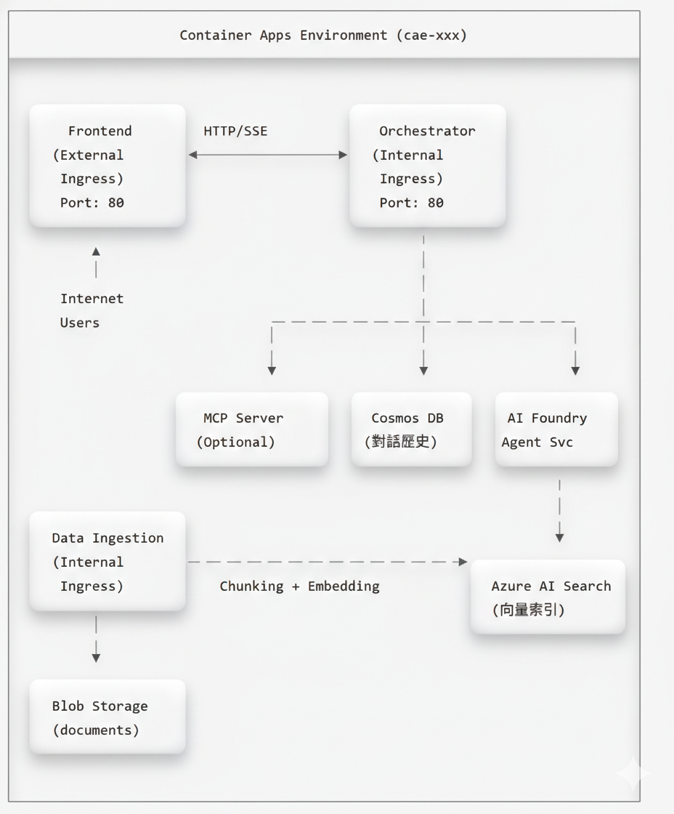

# GPT-RAG Sensengo 專案 Knowledge Transfer 文件

> **專案名稱**: GPT-RAG Sensengo (林口恩典大樓企業資訊 Agent)  
> **客戶**: 東森集團企業 (sensengo.com.tw)  
> **建立日期**: 2026年2月6日  
> **版本**: 1.0

---

## 📋 目錄

1. [專案概覽](#1-專案概覽)
2. [系統架構](#2-系統架構)
3. [部署指南](#3-部署指南)
4. [開發指南](#4-開發指南)
5. [疑難排解](#5-疑難排解)

---

## 1. 專案概覽

### 1.1 專案背景

東森集團正在興建「林口恩典大樓」(Grace Tower)，包含辦公室、酒店、餐廳、商場、教堂、展演空間等設施。此專案需要一個企業級 RAG (Retrieval-Augmented Generation) 系統，協助內部員工查詢專案相關資訊並進行商業規劃。

### 1.2 專案目標

| 目標 | 說明 |
|------|------|
| **正確性與創造性平衡** | Agent 需能精確回答資料，同時具備創意發想能力 |
| **多模態支援** | 處理 Word、PowerPoint、Excel、圖片等多種檔案格式 |
| **檔案管理** | 支援上傳、刪除、版本控管 |
| **跨裝置存取** | 支援桌面、手機、平板等多種裝置 |

### 1.3 準確性聲明

> **重要提醒**：本 GPT-RAG 解決方案加速器**無法保證 100% 的回答準確性**。主要影響因素包括：
>
> 1. **LLM 模型本身的限制** — 即便是最先進的 GPT 模型，仍可能產生「幻覺」(Hallucination)，即生成看似合理但實際上不正確的內容。這是目前大型語言模型的固有特性，無法完全消除。
> 2. **知識庫資料的數量與品質** — AI Search 引擎的回答品質直接取決於已匯入的文件資料。若資料不完整、過時或品質不佳，將導致檢索結果不精確，進而影響最終回答的正確性。
>
> 因此，建議使用者將系統回答作為**參考輔助**，對於關鍵決策仍應進行人工驗證。

### 1.4 技術選型

本專案採用 Microsoft GPT-RAG 解決方案加速器，基於以下技術：

| 層級 | 技術 |
|------|------|
| **AI 框架** | Azure AI Foundry Agent Service (azure-ai-agents>=1.2.0b4) |
| **LLM 模型** | GPT-5.2 (GlobalStandard) |
| **向量搜尋** | Azure AI Search (azure-search-documents 11.5~11.7) |
| **Embedding** | text-embedding-3-large |
| **後端框架** | FastAPI 0.115+ / Uvicorn 0.34+ / Python 3.12 |
| **前端框架** | Chainlit 2.6.0 |
| **AI 擴展** | Semantic Kernel 1.34+ (含 MCP 支援) |
| **容器運行** | Azure Container Apps (Consumption) |
| **IaC 工具** | Bicep + Azure Developer CLI (azd 1.22+) |

---

## 2. 系統架構

### 2.1 高層架構圖



### 2.2 Azure 資源清單

| 資源類型 | 命名規則 | SKU/層級 | 用途 |
|---------|---------|----------|------|
| **AI Foundry** | `aif-{token}-GPRAG` | Standard | AI 模型管理平台 |
| **Azure OpenAI** | (AI Foundry 內建) | GlobalStandard | LLM 推理 |
| **Azure AI Search** | `srch-{token}-GPRAG` | Basic | 向量與混合搜尋 |
| **Cosmos DB** | `cosmos-{token}-GPRAG` | Serverless | 對話歷史儲存 |
| **Container Apps** | `ca-{token}-*-GPRAG` | Consumption | 微服務運行 |
| **Container Apps Env** | `cae-{token}-GPRAG` | - | 共用環境 |
| **Container Registry** | `cr{token}GPRAG` | Standard | Docker 映像 |
| **Storage Account** | `st{token}GPRAG` | Standard LRS | 文檔儲存 |
| **App Configuration** | `appcs-{token}-GPRAG` | Standard | 集中配置 |
| **Key Vault** | `kv-{token}-GPRAG` | Standard | 密鑰管理 |
| **Log Analytics** | `log-{token}-GPRAG` | Pay-as-you-go | 日誌收集 |
| **Application Insights** | `appi-{token}-GPRAG` | Pay-as-you-go | 應用監控 |

> **Token 說明**: `{token}` 是由 azd 自動產生的唯一識別碼，例如 `2v3lfktkn4xam`

### 2.3 Container Apps 服務

| 服務 | Container App 名稱 | 功能 | Ingress |
|------|-------------------|------|---------|
| **Frontend** | `ca-{token}-frontend-GPRAG` | Chainlit 聊天介面 | External |
| **Orchestrator** | `ca-{token}-orch-GPRAG` | RAG 核心引擎 | Internal |
| **DataIngest** | `ca-ingest-GPRAG` | 文件處理與索引 | Internal |
| **MCP** | `ca-{token}-mcp-GPRAG` | 工具擴充 (選用) | Internal |

### 2.4 AI 模型部署

| 模型 | 部署名稱 | SKU | 容量 (TPM) | 用途 |
|------|---------|-----|-----------|------|
| **GPT-5.2** | `chat` | GlobalStandard | 80K | 對話生成 |
| **text-embedding-3-large** | `text-embedding` | Standard | 40K | 向量嵌入 |

### 2.5 資料流程

#### 查詢處理流程

```
1. 使用者在 Chainlit 介面輸入問題
          ↓
2. Frontend 發送 HTTP POST 到 Orchestrator (SSE 串流)
          ↓
3. Orchestrator 從 Cosmos DB 載入對話歷史
          ↓
4. Orchestrator 呼叫 Azure AI Foundry Agent Service
          ↓
5. Agent 決定呼叫 search_knowledge_base 工具
          ↓
6. AI Search 執行向量相似度搜尋，返回相關文件片段
          ↓
7. LLM (GPT-5.2) 根據檢索結果生成回應
          ↓
8. 回應透過 SSE 串流傳回 Frontend
          ↓
9. 對話儲存到 Cosmos DB
```

**API Flow**:

```
┌─────────────┐      POST /orchestrator (SSE)      ┌───────────────┐
│  Frontend   │ ──────────────────────────────────► │  Orchestrator │
│ (Chainlit)  │ ◄────────────────────────────────── │   (FastAPI)   │
└─────────────┘      SSE Stream (text/event-stream) └───────────────┘
                                                            │
                     ┌──────────────────────────────────────┼──────────────────┐
                     │                                      │                  │
                     ▼                                      ▼                  ▼
              ┌────────────┐                      ┌──────────────┐    ┌─────────────┐
              │ Cosmos DB  │                      │ AI Foundry   │    │  AI Search  │
              │  (History) │                      │ Agent Service│    │   (RAG)     │
              └────────────┘                      └──────────────┘    └─────────────┘
```

**查詢處理 Function 呼叫鏈**:

以下描述每個 Function 被誰呼叫、輸入什麼、內部再呼叫誰、輸出什麼：

---

**① `app.handle_message()`** — 使用者訊息進入點

| 項目 | 說明 |
|------|------|
| **檔案** | `gpt-rag-ui/app.py` (Chainlit `@cl.on_message` handler) |
| **呼叫者** | Chainlit 框架 (使用者在聊天介面送出訊息時自動觸發) |
| **輸入** | `cl.Message` 物件，包含 `message.content` (使用者問題)、`message.id` |
| **內部處理** | 1. 取得 `conversation_id`、`auth_info`、`debug_mode`、`search_index` 等 session 參數<br>2. 呼叫 **② `call_orchestrator_stream()`** |
| **輸出** | SSE 串流回應，逐 chunk 透過 `response_msg.stream_token()` 顯示在 Chainlit UI |

---

**② `call_orchestrator_stream()`** — Frontend → Orchestrator HTTP Client

| 項目 | 說明 |
|------|------|
| **檔案** | `gpt-rag-ui/orchestrator_client.py` |
| **呼叫者** | `app.handle_message()` |
| **輸入** | `conversation_id`, `question` (str), `auth_info` (dict), `question_id`, `debug_mode`, `search_index` |
| **內部處理** | 1. 讀取 `ORCHESTRATOR_BASE_URL` 或組合 Dapr sidecar URL<br>2. 組裝 HTTP headers (`X-API-KEY` / `dapr-api-token`)<br>3. 組裝 JSON payload: `{ask, question, conversation_id, client_principal_id, client_principal_name, debug_mode, search_index, ...}`<br>4. 使用 `httpx.AsyncClient.stream("POST", url, json=payload)` 發送請求<br>5. 呼叫 **③ `POST /orchestrator`** |
| **輸出** | `AsyncIterator[str]` — SSE 文字串流 (每個 chunk yield 回給呼叫者) |

---

**③ `orchestrator_endpoint()`** — FastAPI Endpoint

| 項目 | 說明 |
|------|------|
| **檔案** | `gpt-rag-orchestrator/src/main.py` |
| **呼叫者** | `call_orchestrator_stream()` 透過 HTTP POST |
| **輸入** | `OrchestratorRequest` (Pydantic model，定義在 `schemas.py`)：<br>- `ask` (str, 必填) — 使用者問題<br>- `conversation_id` (str, 選填) — 對話 ID<br>- `debug_mode` (bool, 選填) — 啟用 debug<br>- `search_index` (str, 選填) — 指定 AI Search 索引<br>- `type` (str, 選填) — `"feedback"` 則走回饋路徑<br>- `question_id`, `client_principal_id`, `client_principal_name`, `client_group_names`, `access_token`, `user_context` 等 |
| **內部處理** | 1. 驗證認證 (`validate_auth` dependency, 檢查 `X-API-KEY` 或 `dapr-api-token`)<br>2. 若 `type == "feedback"` → 呼叫 `orchestrator.save_feedback()` 後直接回傳<br>3. 否則呼叫 **④ `Orchestrator.create()`** 建立實例<br>4. 呼叫 **⑤ `orchestrator.stream_response(ask)`** 取得回應串流<br>5. 包裝為 `StreamingResponse(media_type="text/event-stream")` |
| **輸出** | `StreamingResponse` — SSE 串流，包含 `conversation_id` + 回應文字 + debug events |

---

**④ `Orchestrator.create()`** — 建立 Orchestrator 實例

| 項目 | 說明 |
|------|------|
| **檔案** | `gpt-rag-orchestrator/src/orchestration/orchestrator.py` |
| **呼叫者** | `orchestrator_endpoint()` |
| **輸入** | `conversation_id`, `user_context` (dict), `debug_mode` (bool), `search_index` (str) |
| **內部處理** | 1. 初始化 `CosmosDBClient` (對話歷史存取)<br>2. 從 App Configuration 讀取 `AGENT_STRATEGY` (預設 `"single_agent_rag"`)<br>3. 呼叫 `AgentStrategyFactory.get_strategy(name)` → 得到 Strategy 實例<br>4. 將 `debug_mode`、`search_index` 設定到 Strategy 上 |
| **輸出** | `Orchestrator` 實例 (含已初始化的 `agentic_strategy`) |

**`AgentStrategyFactory.get_strategy()`** 對照表 (定義在 `strategies/agent_strategy_factory.py`)：

| Key | 對應 Class | 檔案 |
|-----|-----------|------|
| `single_agent_rag` | `SingleAgentRAGStrategyV1` | `strategies/single_agent_rag_strategy_v1.py` |
| `mcp` | `McpStrategy` | `strategies/mcp_strategy.py` |
| `nl2sql` | `NL2SQLStrategy` | `strategies/nl2sql_strategy.py` |

---

**⑤ `Orchestrator.stream_response(ask)`** — 核心協調流程

| 項目 | 說明 |
|------|------|
| **檔案** | `gpt-rag-orchestrator/src/orchestration/orchestrator.py` |
| **呼叫者** | `orchestrator_endpoint()` (在 SSE generator 中) |
| **輸入** | `ask` (str 使用者問題), `question_id` (str, 選填) |
| **內部處理** | 1. 從 Cosmos DB 載入或建立 conversation document<br>2. 記錄 question_id 到 conversation<br>3. 將 conversation 傳給 strategy<br>4. 呼叫 **⑥ `strategy.initiate_agent_flow(ask)`** 取得回應串流<br>5. 完成後更新 conversation document 至 Cosmos DB |
| **輸出** | `AsyncIterator[str]` — 先 yield `{conversation_id} `，再 yield 所有 strategy 回應 chunk |

---

**⑥ `SingleAgentRAGStrategyV1.initiate_agent_flow(ask)`** — Agent 執行流程

| 項目 | 說明 |
|------|------|
| **檔案** | `gpt-rag-orchestrator/src/strategies/single_agent_rag_strategy_v1.py` |
| **呼叫者** | `Orchestrator.stream_response()` |
| **輸入** | `user_message` (str 使用者問題) |
| **內部處理 (依序)** | **Step 1**: `_get_or_create_thread()` — 建立或取回 AI Foundry Agent Thread<br>**Step 2**: `_get_or_create_agent()` — 建立 Agent (含 system prompt, tools 定義)<br>**Step 3**: `_send_user_message()` — 將 user_message 送入 Thread<br>**Step 4**: `_stream_agent_response()` → 呼叫 **⑦ Agent Run Stream**<br>**Step 5**: `_consolidate_conversation_history()` — 從 Thread 取回完整對話歷史<br>**Step 6**: `_cleanup_agent()` — 刪除暫時 Agent |
| **內部 Tools** | Agent 初始化時註冊的 FunctionTools：<br>- **⑧ `SearchClient.search_knowledge_base(query)`** — RAG 知識庫搜尋<br>- **⑨ `CallTranscriptClient.query_call_transcripts(...)`** — 通話記錄查詢 (若啟用)<br>- `BingGroundingTool` — Bing 搜尋 (若啟用) |
| **輸出** | `AsyncIterator[str]` — Agent 回應文字 chunk + debug events (若 debug mode) |

---

**⑦ `_stream_agent_response()`** — Agent Run 串流

| 項目 | 說明 |
|------|------|
| **檔案** | `gpt-rag-orchestrator/src/strategies/single_agent_rag_strategy_v1.py` |
| **呼叫者** | `initiate_agent_flow()` Step 4 |
| **輸入** | `project_client`, `agent_id`, `thread_id`, `user_message` |
| **內部處理** | 1. 呼叫 `project_client.agents.runs.stream(thread_id, agent_id)` 啟動 Agent Run<br>2. LLM 第一次思考 → 決定需要呼叫哪些 Tools<br>3. Auto-execute registered Tools (**⑧** 或 **⑨**) — SDK 自動執行<br>4. LLM 第二次思考 → 基於 Tool 結果生成最終回應<br>5. 處理 `thread.message.delta` 事件，逐 chunk yield 回應文字 |
| **輸出** | `AsyncIterator[str]` — 回應文字 chunk (含引用處理) |

---

**⑧ `SearchClient.search_knowledge_base(query)`** — RAG 知識庫搜尋

| 項目 | 說明 |
|------|------|
| **檔案** | `gpt-rag-orchestrator/src/connectors/search.py` |
| **呼叫者** | AI Foundry Agent SDK auto-execute (當 Agent 決定需要搜尋知識庫時) |
| **輸入** | `query` (str) — Agent 產生的搜尋查詢 |
| **內部處理** | 1. 依 `search_approach` (hybrid/vector/term) 組裝搜尋 body<br>2. 若 vector/hybrid → 呼叫 Azure OpenAI `get_embeddings(query)` 產生向量<br>3. 呼叫 Azure AI Search REST API 執行搜尋<br>4. 解析結果取 `title`, `content`, `url`, `filepath` |
| **輸出** | JSON string — `[{title, link, content}, ...]` 搜尋結果列表 |

---

**⑨ `CallTranscriptClient.query_call_transcripts(...)`** — 通話記錄查詢

| 項目 | 說明 |
|------|------|
| **檔案** | `gpt-rag-orchestrator/src/connectors/call_transcripts.py` |
| **呼叫者** | AI Foundry Agent SDK auto-execute (當 Agent 決定需要查詢通話記錄時) |
| **輸入** | `customer_id` (str, 選填), `status` (str, 選填: "成功"/"失敗"), `call_date` (str, 選填: "YYYY-MM-DD"), `keyword` (str, 選填), `top` (int, 預設 10), `include_full_transcript` (str, 預設 "false") |
| **內部處理** | 1. 動態組裝 Cosmos DB SQL 查詢 (WHERE 條件)<br>2. 透過 `CosmosClient` 查詢 `call-transcripts` container<br>3. 格式化結果 (截斷 transcript 至前 300 字元，除非 `include_full_transcript=true`) |
| **輸出** | JSON string — 包含符合條件的通話記錄列表 |

#### 文件 Ingestion 流程

```
1. 使用者上傳文件到 Blob Storage (documents container)
          ↓
2. Ingestion Service 依 CRON 排程觸發
          ↓
3. 讀取文件並依類型選擇 Chunker
   ├── PDF/DOCX/PPTX → Document Intelligence
   ├── XLSX → SpreadsheetChunker
   └── 其他 → LangChain Chunker
          ↓
4. 文件切分成 Chunks (預設 2048 tokens)
          ↓
5. Azure OpenAI 生成向量嵌入 (text-embedding-3-large)
          ↓
6. Chunks + Vectors 上傳到 Azure AI Search
          ↓
7. 寫入 Job 執行記錄
```

**API Flow**:

```
┌─────────────┐     Upload file      ┌──────────────┐
│    User     │ ────────────────────► │ Blob Storage │
└─────────────┘                       │ (documents)  │
                                      └──────────────┘
                                             │
                                             │ CRON Trigger
                                             ▼
┌─────────────────────────────────────────────────────────────────┐
│                     Ingestion Service                           │
│  ┌───────────────┐    ┌─────────────┐    ┌──────────────────┐   │
│  │ Read Document │ ─► │   Chunker   │ ─► │ Generate Embedding│  │
│  │ (Blob Client) │    │  (Factory)  │    │ (Azure OpenAI)    │  │
│  └───────────────┘    └─────────────┘    └──────────────────┘   │
└─────────────────────────────────────────────────────────────────┘
                                             │
                                             │ Upload Index
                                             ▼
                                      ┌──────────────┐
                                      │  AI Search   │
                                      │   (Index)    │
                                      └──────────────┘
```

**Ingestion Function 呼叫鏈** (CRON 排程路徑):

以下描述 Blob 索引排程 (最主要路徑) 中每個 Function 的呼叫關係：

---

**❶ `lifespan()` → Scheduler 啟動** — 應用程式啟動入口

| 項目 | 說明 |
|------|------|
| **檔案** | `gpt-rag-ingestion/main.py` |
| **呼叫者** | FastAPI 框架 (應用程式啟動時自動執行) |
| **輸入** | 無 (讀取 App Configuration 中的 CRON 設定) |
| **內部處理** | 1. 驗證 Azure 認證 (Managed Identity / Service Principal / az login)<br>2. 初始化 App Configuration Client<br>3. 讀取各 `CRON_RUN_*` 設定，透過 APScheduler `CronTrigger` 註冊排程<br>4. 啟動時立即執行一次已排程的 Jobs (如 **❷ `run_blob_index()`**) |
| **輸出** | 無 (排程在背景持續運行) |

**排程 Job 對應表**：

| CRON Key | 呼叫 Function | 對應 Class |
|----------|--------------|-----------|
| `CRON_RUN_BLOB_INDEX` | `run_blob_index()` | `BlobStorageDocumentIndexer` |
| `CRON_RUN_BLOB_PURGE` | `run_blob_purge()` | `BlobStorageDeletedItemsCleaner` |
| `CRON_RUN_SHAREPOINT_INDEX` | `run_sharepoint_index()` | `SharePointIndexer` |
| `CRON_RUN_NL2SQL_INDEX` | `run_nl2sql_index()` | `NL2SQLIndexer` |

---

**❷ `run_blob_index()`** — Blob 索引排程觸發點

| 項目 | 說明 |
|------|------|
| **檔案** | `gpt-rag-ingestion/main.py` |
| **呼叫者** | APScheduler CRON 觸發 或 lifespan 啟動時立即呼叫 |
| **輸入** | 無 |
| **內部處理** | 實例化 `BlobStorageDocumentIndexer()` 並呼叫 **❸ `.run()`** |
| **輸出** | 無 (執行結果記錄在 Blob Storage logs) |

---

**❸ `BlobStorageDocumentIndexer.run()`** — Blob 索引核心邏輯

| 項目 | 說明 |
|------|------|
| **檔案** | `gpt-rag-ingestion/jobs/blob_storage_indexer.py` |
| **呼叫者** | `run_blob_index()` |
| **輸入** | `BlobIndexerConfig` (從 App Configuration 讀取)：`storage_account_name`, `source_container`, `search_endpoint`, `search_index_name`, `max_concurrency` 等 |
| **內部處理** | 1. `_ensure_clients()` — 建立 `BlobServiceClient` + `AsyncSearchClient`<br>2. `_load_latest_index_state()` — 從 AI Search 載入現有文件的 `last_modified` map<br>3. 列舉 Blob Storage container 中所有文件<br>4. 比對 `blob.last_modified` > `prev_last_modified` → 篩出需重新索引的文件<br>5. 並行呼叫 **❹ `_process_one()`** 處理每個文件 (受 `max_concurrency` 限制)<br>6. 寫入 run summary 至 Blob Storage jobs log container |
| **輸出** | Summary dict: `{sourceFiles, candidates, indexedItems, success, failed, totalChunksUploaded}` |

---

**❹ `_process_one(blob_name, last_modified, content_type)`** — 單一文件處理

| 項目 | 說明 |
|------|------|
| **檔案** | `gpt-rag-ingestion/jobs/blob_storage_indexer.py` |
| **呼叫者** | `BlobStorageDocumentIndexer.run()` (並行呼叫) |
| **輸入** | `blob_name` (str), `last_modified` (datetime), `content_type` (str), `run_id` (str) |
| **內部處理** | 1. 從 Blob Storage 下載文件 bytes (`blob_client.download_blob()`)<br>2. 讀取 blob metadata 中的 `security_ids` (文件權限控制)<br>3. 組裝 `data = {documentUrl, documentContentType, documentBytes, fileName}`<br>4. 呼叫 **❺ `DocumentChunker().chunk_documents(data)`** 進行文件切分<br>5. 將 chunks 轉換為 AI Search documents (`_to_search_doc()`)<br>6. 呼叫 `_replace_parent_docs()` — 刪除舊 chunks 後上傳新 chunks 至 AI Search<br>7. 寫入 per-file log |
| **輸出** | `{status: "success", chunks: N}` 或 `{status: "error", error: "..."}` |

---

**❺ `DocumentChunker.chunk_documents(data)`** — 文件切分入口

| 項目 | 說明 |
|------|------|
| **檔案** | `gpt-rag-ingestion/chunking/document_chunking.py` |
| **呼叫者** | `_process_one()` 或 `/document-chunking` HTTP endpoint |
| **輸入** | `data` (dict): `{documentUrl, documentContentType, documentBytes, fileName}` |
| **內部處理** | 1. 呼叫 **❻ `ChunkerFactory().get_chunker(data)`** 取得對應的 Chunker<br>2. 呼叫 `chunker.get_chunks()` 執行實際切分 |
| **輸出** | `(chunks, errors, warnings)` — chunks 為 dict list，每個含 `content`, `title`, `url` 等 |

---

**❻ `ChunkerFactory.get_chunker(data)`** — Chunker 工廠

| 項目 | 說明 |
|------|------|
| **檔案** | `gpt-rag-ingestion/chunking/chunker_factory.py` |
| **呼叫者** | `DocumentChunker.chunk_documents()` |
| **輸入** | `data` (dict) — 包含 `fileName` 用以判斷副檔名 |
| **內部處理** | 依檔案副檔名選擇 Chunker 實例 |
| **輸出** | 對應的 Chunker 實例 |

**Chunker 對照表**：

| 副檔名 | Chunker Class | 說明 |
|--------|--------------|------|
| `pdf`, `png`, `jpeg`, `jpg`, `bmp`, `tiff` | `DocAnalysisChunker` | 透過 Document Intelligence 分析 |
| `docx`, `pptx` | `DocAnalysisChunker` | 需 Doc Intelligence 4.0 API |
| `xlsx`, `xls` | `SpreadsheetChunker` | 試算表切分 |
| `vtt` | `TranscriptionChunker` | 字幕/逐字稿 |
| `json` | `JSONChunker` | JSON 資料切分 |
| `nl2sql` | `NL2SQLChunker` | NL2SQL schema 切分 |
| 其他 (`txt`, `md` 等) | `LangChainChunker` | LangChain 通用文字切分 |

> 若 `MULTIMODAL=true`，PDF/圖片/DOCX/PPTX 會改用 `MultimodalChunker`。

---

**Ingestion HTTP Endpoints 呼叫鏈** (手動觸發路徑):

除了 CRON 排程，也可透過 HTTP API 手動觸發：

**❼ `POST /document-chunking`** — 手動文件切分

| 項目 | 說明 |
|------|------|
| **檔案** | `gpt-rag-ingestion/main.py` |
| **呼叫者** | Azure AI Search Skillset 或手動 HTTP 呼叫 |
| **認證** | API Key (`validate_api_key_header`) |
| **輸入** | JSON Body: `{"values": [{"recordId": "1", "data": {"documentUrl": "https://...", "documentContentType": "application/pdf"}}]}` |
| **內部處理** | 1. JSON Schema 驗證<br>2. 透過 `BlobClient` 下載文件 bytes<br>3. 呼叫 **❺ `DocumentChunker().chunk_documents(data)`**<br>4. 組裝回應 |
| **輸出** | JSON: `{"values": [{"recordId": "1", "data": {"chunks": [...]}, "errors": [], "warnings": []}]}` |

---

**❽ `POST /text-embedding`** — 手動向量嵌入

| 項目 | 說明 |
|------|------|
| **檔案** | `gpt-rag-ingestion/main.py` |
| **呼叫者** | Azure AI Search Skillset 或手動 HTTP 呼叫 |
| **認證** | API Key (`validate_api_key_header`) |
| **輸入** | JSON Body: `{"values": [{"recordId": "1", "data": {"text": "要嵌入的文字"}}]}` |
| **內部處理** | 1. 實例化 `AzureOpenAIClient()`<br>2. 對每個 item 呼叫 `aoai_client.get_embeddings(text)` (Azure OpenAI text-embedding-3-large)<br>3. 組裝回應 |
| **輸出** | JSON: `{"values": [{"recordId": "1", "data": {"embedding": [0.012, -0.034, ...]}, "errors": [], "warnings": []}]}` |

---

## 3. 部署指南

### 3.1 先決條件

#### 工具安裝

| 工具 | 版本 | 安裝指令 |
|------|------|----------|
| Azure CLI | 2.80+ | `winget install Microsoft.AzureCLI` |
| Azure Developer CLI | 1.22+ | `winget install Microsoft.Azd` |
| Docker | 29+ | [Docker Desktop](https://www.docker.com/products/docker-desktop/) |
| Python | 3.12 | `winget install Python.Python.3.12` |
| Git | 最新 | `winget install Git.Git` |

#### Azure 權限

- 訂閱層級 **Owner** 或 **Contributor + User Access Administrator**
- 需註冊以下 Resource Provider：
  - `Microsoft.AppConfiguration`
  - `Microsoft.DocumentDB`
  - `Microsoft.ContainerService`
  - `Microsoft.CognitiveServices`

### 3.2 部署步驟

#### Step 1: 登入 Azure

```powershell
# 登入指定租戶
az login --tenant {tenant-id}

# 設定訂閱
az account set --subscription "{subscription-name}"

# 驗證權限
az role assignment list --assignee $(az ad signed-in-user show --query id -o tsv) --query "[].roleDefinitionName" -o table
```

#### Step 2: 設定 azd 環境

```powershell
cd GPT-RAG

# 初始化環境
azd init -e {environment-name}

# 設定區域
azd env set AZURE_LOCATION eastus2
```

#### Step 3: 佈建基礎設施

```powershell
# 執行 Bicep 部署
azd provision
```

預期結果：約 20-25 個 Azure 資源建立完成

#### Step 4: 部署應用程式

```powershell
# 部署所有服務
azd deploy
```

如果 `azd deploy` 失敗，可手動部署：

```powershell
# 登入 ACR
az acr login --name cr{token}

# 建置並推送 Frontend
cd ../gpt-rag-ui
$ts = Get-Date -Format "yyyyMMddHHmmss"
docker build -t cr{token}.azurecr.io/azure-gpt-rag/frontend:$ts .
docker push cr{token}.azurecr.io/azure-gpt-rag/frontend:$ts

# 更新 Container App
az containerapp update --name ca-{token}-frontend --resource-group GPRAG `
  --image cr{token}.azurecr.io/azure-gpt-rag/frontend:$ts
```

### 3.3 部署後驗證

#### 驗證清單

- [ ] Container Apps 狀態為 Running
- [ ] Frontend URL 可正常存取
- [ ] AI Search 索引已建立
- [ ] App Configuration 參數正確

#### 驗證指令

```powershell
# 檢查 Container Apps 狀態
az containerapp list --resource-group GPRAG --query "[].{name:name, state:properties.runningStatus}" -o table

# 檢查 AI Search 索引
$searchEndpoint = "https://srch-{token}.search.windows.net"
$token = az account get-access-token --resource "https://search.azure.com" --query accessToken -o tsv
Invoke-RestMethod -Uri "$searchEndpoint/indexes?api-version=2023-11-01" `
  -Headers @{ "Authorization" = "Bearer $token" }
```

---

## 4. 開發指南

### 4.1 Debug 面板功能

Frontend 內建 Debug 面板，可顯示詳細的執行資訊：

**啟用方式**：
- 預設為啟用
- 輸入 `/debug off` 可關閉
- 輸入 `/debug` 或 `/debug on` 重新啟用

**顯示內容**：

| 面板 | 內容 |
|------|------|
| **Timing** | 各階段執行時間 (Thread/Agent 管理、LLM 思考、工具執行等) |
| **Prompting Details** | System Prompt、Tool Calls、Search Results、LLM Calls |

**UI 佈局**：左右分割 (問答區 55%、Debug Panel 45%)

### 4.2 Agent 策略切換

系統支援三種 Agent 策略：

| 策略 | 設定值 | 說明 |
|------|--------|------|
| **Single Agent RAG** | `single_agent_rag` | 預設模式，單一 Agent + RAG 工具 |
| **MCP** | `mcp` | Model Context Protocol 擴充工具 |
| **NL2SQL** | `nl2sql` | 自然語言轉 SQL 查詢 |

切換方式：在 App Configuration 設定 `AGENT_STRATEGY`

```powershell
az appconfig kv set --endpoint "https://appcs-{token}.azconfig.io" `
  --key "AGENT_STRATEGY" --value "single_agent_rag" --label "gpt-rag" --auth-mode login -y
```

### 4.2.1 擴展工具：MCP vs 本地 FunctionTool

系統已部署獨立的 **MCP Container App**（`gpt-rag-mcp`），提供標準化的工具擴展機制。新增工具有兩種方式：

| | MCP 方式 | 本地 FunctionTool 方式 |
|---|---|---|
| **工具定義** | 在 MCP server 用 `@mcp.tool()` 裝飾器 | 在 orchestrator 的 `connectors/` 寫完整 Python class |
| **發現機制** | Semantic Kernel 自動發現所有工具 | 需手動建立 `FunctionTool` 並註冊到 `tools_list` |
| **執行位置** | MCP Container（獨立程序） | Orchestrator 程序內 |
| **Agent 引擎** | Semantic Kernel `ChatCompletionAgent` | Azure AI Foundry Agent Service |
| **新增工具成本** | 只改 MCP server，重新部署 MCP container | 需改 orchestrator 程式碼，重新部署 orchestrator |
| **策略設定** | `AGENT_STRATEGY=mcp` | `AGENT_STRATEGY=single_agent_rag` |

**MCP 方式**：只要在 `gpt-rag-mcp/src/server.py` 中用 `@mcp.tool()` 定義好工具介面，Orchestrator 透過 Semantic Kernel 的 `MCPSsePlugin` 就能自動發現並呼叫，無需修改 Orchestrator 程式碼。

**本地 FunctionTool 方式**（如 `call_transcripts`）：需自行實作完整的連線邏輯、查詢建構、結果格式化，並在 strategy 中手動註冊為 `FunctionTool`。

> ⚠️ **注意**：兩種策略使用**不同的 Agent 引擎**（MCP = Semantic Kernel, RAG = Azure AI Foundry Agent），切換時整個 agent 執行和對話管理方式都會改變。目前 MCP server 僅有 demo 工具（`add`、`wikipedia_search`），實際業務工具需另行開發並註冊。

**MCP 相關 App Configuration**：

| Key | 說明 | 預設值 |
|-----|------|--------|
| `MCP_APP_ENDPOINT` | MCP 伺服器 URL | `http://localhost:80` |
| `MCP_CLIENT_TIMEOUT` | 連線逾時（秒） | `600` |
| `MCP_APP_APIKEY` | API 金鑰（可選） | `None` |
| `MCP_SERVER_TRANSPORT` | 傳輸方式 | `sse` |

### 4.3 設定參數清單

#### 核心設定

| Key | 說明 | 預設值 |
|-----|------|--------|
| `AGENT_STRATEGY` | Agent 策略 | `single_agent_rag` |
| `CHAT_DEPLOYMENT_NAME` | LLM 部署名稱 | `chat` |
| `EMBEDDING_DEPLOYMENT_NAME` | Embedding 部署名稱 | `embedding` |
| `SEARCH_RAGINDEX_TOP_K` | 搜尋結果數量 | `3` |
| `SEARCH_APPROACH` | 搜尋方法 (hybrid/vector/term) | `hybrid` |
| `ORCHESTRATOR_URI` | Orchestrator 內部 URL | (自動設定) |

#### Ingestion 設定

| Key | 說明 | 預設值 |
|-----|------|--------|
| `CRON_RUN_BLOB_INDEX` | Blob 索引排程 | `0 */6 * * *` |
| `CRON_RUN_BLOB_PURGE` | Blob 清理排程 | `0 0 * * *` |
| `RUN_JOBS_ON_STARTUP` | 啟動時執行 Job | `true` |
| `DOCUMENTS_STORAGE_CONTAINER` | 文件容器名稱 | `documents` |
| `SEARCH_RAG_INDEX_NAME` | 搜尋索引名稱 | `ragindex-{token}` |

#### Chunking 設定

| Key | 說明 | 預設值 |
|-----|------|--------|
| `CHUNKING_NUM_TOKENS` | 一般文件 Chunk 大小 | `2048` |
| `TOKEN_OVERLAP` | Chunk 重疊 tokens | `100` |
| `CHUNKING_MIN_CHUNK_SIZE` | 最小 Chunk 大小 | `100` |
| `SPREADSHEET_CHUNKING_NUM_TOKENS` | Excel Chunk 大小 | `0` (無限制) ⚠️ |
| `SPREADSHEET_CHUNKING_BY_ROW` | 按列切分 Excel | `false` |

> ⚠️ **注意**: `SPREADSHEET_CHUNKING_NUM_TOKENS=0` 表示不限制大小，可能產生超大 Chunk (如 31,772 字元)。建議設為 `2048`。

#### Chunker 對應表

| 檔案類型 | Chunker |
|----------|---------|
| `.pdf`, `.docx`, `.pptx`, `.png`, `.jpg` | DocAnalysisChunker (使用 Document Intelligence) |
| `.xlsx`, `.xls` | SpreadsheetChunker |
| `.json` | JSONChunker |
| `.vtt` | TranscriptionChunker |
| `.md`, `.txt`, `.html`, `.py` | LangChainChunker |

---

## 5. 疑難排解

### 5.1 常見問題

#### 問題 1: Frontend 顯示 "An internal server error occurred."

**可能原因**:
1. Cosmos DB 防火牆阻擋
2. TPM 配額用完
3. Orchestrator 連線失敗

**排查步驟**:
```powershell
# 1. 檢查 Cosmos DB 網路設定
az cosmosdb show --name cosmos-{token} --resource-group GPRAG `
  --query "publicNetworkAccess"

# 2. 檢查 Orchestrator 日誌
az containerapp logs show --name ca-{token}-orch --resource-group GPRAG --tail 100
```

#### 問題 2: Ingestion 失敗 - AuthorizationFailure

**原因**: Storage Account `publicNetworkAccess` 設為 Disabled

**解決**:
```powershell
az storage account update --name st{token} --resource-group GPRAG `
  --public-network-access Enabled
```

#### 問題 3: Container App OOM Killed

**症狀**: Container 頻繁重啟，Exit Code 137

**解決**: 增加記憶體配置
```powershell
az containerapp update --name ca-ingest-gprag --resource-group GPRAG `
  --cpu 1.0 --memory 2Gi
```

#### 問題 4: 回應延遲過長

**實測數據**: 冷啟動 40–50s，暖機後平均 ~15-16s

**冷啟動**（`minReplicas=0`，閒置 5 分鐘後 scale-to-zero）:

| 階段 | 時間 |
|------|------|
| Container 啟動 | ~5-10s |
| Python/FastAPI 初始化 | ~2-3s |
| Azure AD Token 取得 | ~2-3s |
| DB 連線建立 | ~2-3s |
| Agent Service 初始化 | ~3-5s |

**暖機後瓶頸分佈** (~15-16s):

| 階段 | 時間 | 佔比 |
|------|------|------|
| LLM 處理搜尋結果 | ~8-10s | 55% ❌ 最大瓶頸 |
| Agent 思考＋選擇工具 | ~3-4s | 22% |
| Cosmos DB | ~1-2s | 8% |
| 搜尋執行 | ~1-1.5s | 7% |
| 後處理 | ~1s | 5% |
| Thread/Agent 建立 | ~0.5s | 3% |

**根因**: Excel `SPREADSHEET_CHUNKING_NUM_TOKENS=0`（無限制），每個 sheet 變成一個 ~8,000-10,000 tokens 的 chunk，topK=3 搜尋後送入 LLM 的 token 量高達 ~24,000。

**已驗證的優化方案（2026-02-25）**:

| 方案 | 效果 | 風險 |
|------|------|------|
| **Hybrid chunking**（by-sheet + by-row 同時寫入 index） | 品質最佳（0 次回答錯誤）、速度不變 | 零風險 ✅ |
| **設定 AGENT_ID**（預建立 Agent） | 每次省 ~1.5s | 零風險 ✅ |
| **minReplicas=1** | 消除冷啟動 | +$30-50/月 |
| **切換 gpt-4o-mini / GPT-4 nano** | 快 50-60%（預估） | 需驗證品質 |
| **Lite prompt** | 省 ~450 tokens/次（速度無差異） | 零風險 |

### 5.2 成本及配額說明（Cost & Quota Awareness）

**主要成本來源**

| 元件 | 成本驅動因素 |
|------|------------|
| LLM（GPT-5.2） | Prompt token + Completion token |
| Embedding | 文件 chunk 數量與大小 |
| AI Search | Index 大小、查詢次數 |
| Cosmos DB | RU/s 使用量 |

**高成本操作提醒**

- Debug Mode 長時間開啟
- `SEARCH_RAGINDEX_TOP_K` 設定過大
- Chunk size 過大導致 LLM 輸入 token 膨脹
- 頻繁重新 Ingestion 全量文件

**配額**

- 當 LLM TPM 配額用盡時：
  - API 將回傳 429 / 503 錯誤
  - Frontend 可能顯示 Internal Server Error
- 建議設定 Azure Monitor Alert 監控配額使用率

---

*文件結束*
