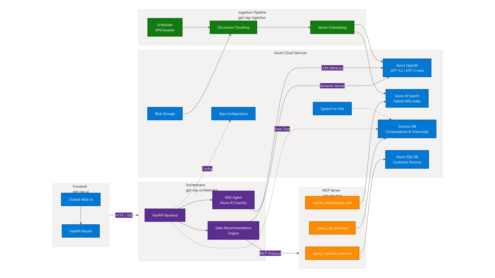
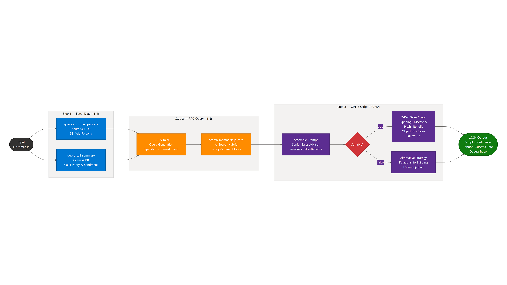

# GPT-RAG Sensengo 專案 Knowledge Transfer 文件 — Part 2: Sales Recommendation Agent

> **專案名稱**: GPT-RAG Sensengo (Sales Recommendation Agent)  
> **客戶**: 東森集團企業 (sensengo.com.tw)  
> **建立日期**: 2026年3月26日  
> **版本**: 1.0  
> **前置文件**: [Knowledge Transfer Part 1](knowledge-transfer.md) — RAG 基礎架構、Ingestion、部署指南

---

## 📋 目錄

1. [功能概覽](#1-功能概覽)
2. [系統架構](#2-系統架構)
3. [三步驟工作流程詳解](#3-三步驟工作流程詳解)
4. [MCP Server 工具清單](#4-mcp-server-工具清單)
5. [資料模型](#5-資料模型)
6. [通話逐字稿 Ingest Pipeline](#6-通話逐字稿-ingest-pipeline)
7. [Demo Web UI](#7-demo-web-ui)
8. [AI 模型部署與配置](#8-ai-模型部署與配置)
9. [設定參數清單](#9-設定參數清單)
10. [部署指南](#10-部署指南)
11. [效能基準與成本](#11-效能基準與成本)
12. [已知限制與注意事項](#12-已知限制與注意事項)

---

## 1. 功能概覽

### 1.1 背景

東森集團的電話銷售團隊（OB, Outbound）在推銷會員卡時，需要根據客戶的消費紀錄、偏好及歷史通話內容，為每位客戶量身打造推薦話術。本模組透過自動化的 AI 分析，為電銷專員生成個人化的銷售策略建議。

### 1.2 核心功能

| 功能 | 說明 |
|------|------|
| **適合度判斷** | AI 先分析客戶是否適合推銷會員卡，包含信心程度、正面/負面因素 |
| **個人化話術** | 7 段結構化話術：開場白、探詢需求、產品推薦、利益點、異議處理、收尾、追蹤 |
| **替代策略** | 當客戶不適合推銷時，提供其他互動策略建議 |
| **地雷偵測** | 標識客戶歷史中的禁忌話題，避免踩雷 |
| **產品推薦** | 根據客戶偏好推薦額外商品，附帶話術片段 |
| **Debug 追蹤** | 每個步驟的耗時、輸入/輸出、Token 使用量完整記錄 |

### 1.3 設計原則

> **先判斷再行動**：系統務必先完成 `membership_suitability` 評估，再決定後續話術方向。
> 若不適合推銷，不會硬推會員卡，而是提供替代策略（如建立關係、推薦單品等）。

---

## 2. 系統架構

### 2.1 高層架構圖



### 2.2 元件關係

```
┌────────────┐      POST /sales/recommendation      ┌───────────────────┐
│ Demo UI    │ ──────────────────────────────────────►│  Orchestrator     │
│ (demo.html)│ ◄──────────────────────────────────── │  (FastAPI)        │
└────────────┘           JSON Response               └─────────┬─────────┘
                                                               │
                                                               │ SalesRecommendationClient
                                                               │ (3-step sequential workflow)
                         ┌─────────────────────────────────────┼──────────────────┐
                         │                                     │                  │
              Step 1a,1b │                          Step 2     │       Step 3     │
                         ▼                                     ▼                  ▼
              ┌──────────────────┐               ┌──────────────────┐   ┌─────────────────┐
              │   MCP Server     │               │  Azure OpenAI    │   │  Azure OpenAI   │
              │  (gpt-rag-mcp)  │               │  (gpt-5-mini)    │   │  (GPT-5.4)      │
              │                  │               │  Query Gen       │   │  Recommendation  │
              └────────┬─────────┘               └──────────────────┘   └─────────────────┘
                       │
         ┌─────────────┼──────────────┐
         │             │              │
         ▼             ▼              ▼
┌──────────────┐ ┌──────────┐ ┌──────────────┐
│ Azure SQL DB │ │ Cosmos DB│ │  AI Search   │
│ (Persona)    │ │  (通話)  │ │  (會員卡)    │
└──────────────┘ └──────────┘ └──────────────┘
```

### 2.3 Azure 資源（Sales Recommendation 新增/共用）

| 資源類型 | 名稱 | 用途 | 備註 |
|---------|------|------|------|
| **Azure SQL Server** | `ehs-sales-sqlserver.database.windows.net` | 客戶 Persona 結構化資料 | **新增**，非 GPT-RAG 原有 |
| **Azure SQL Database** | `salesagent` | Persona Table | SQL Auth |
| **MCP Container App** | `ca-{token}-mcp-gprag` | MCP 工具服務 | Internal Ingress, minReplicas=1 |
| **Azure OpenAI — GPT-5.4** | 部署名 `gpt-54` | Step 3 推薦話術生成 | **新增部署** |
| **Azure OpenAI — GPT-5-mini** | 部署名 `gpt-5-mini` | Step 2 查詢生成 | **新增部署** |
| **Cosmos DB** | `call-transcripts` container | 通話逐字稿 | 共用 Cosmos 帳戶 |
| **AI Search** | `ragindex` | 會員卡權益 RAG 索引 | 共用 AI Search |
| **Blob Storage** | `call-transcripts-stt` container | STT 逐字稿來源 | **新增** container |
| **Blob Storage** | `call-transcripts-stt-processed` container | 已處理逐字稿歸檔 | **新增** container |

---

## 3. 三步驟工作流程詳解

### 3.1 流程圖



### 3.2 時序總覽

```
Step 1 ──────────── Step 2 ────────────────── Step 3 ──────────────────────────────
 ~1-2s                ~1-3s                     ~30-60s
fetch_persona    LLM query gen +           GPT-5.4 reasoning model
fetch_call_summary  AI Search RAG          生成推薦話術 JSON
```

---

### ① `POST /sales/recommendation` — API Endpoint

| 項目 | 說明 |
|------|------|
| **檔案** | `gpt-rag-orchestrator/src/main.py` |
| **認證** | `validate_auth` dependency（`X-API-KEY` 或 `dapr-api-token`） |
| **輸入** | `SalesRecommendationRequest` (Pydantic)：<br>- `customer_id` (str, 必填) — 客戶識別碼<br>- `call_customer_id` (str, 選填) — 通話紀錄的客代（若與 customer_id 不同）<br>- `model_deployment` (str, 選填) — Step 3 模型覆寫<br>- `query_gen_deployment` (str, 選填) — Step 2 模型覆寫 |
| **內部處理** | 1. 建立 `SalesRecommendationClient` 實例<br>2. 呼叫 `generate_recommendation()` |
| **輸出** | JSON: `{customer_id, call_customer_id, recommendation: {...}, debug: {steps, total_seconds}}` |

---

### ② `SalesRecommendationClient.generate_recommendation()` — 核心工作流程

| 項目 | 說明 |
|------|------|
| **檔案** | `gpt-rag-orchestrator/src/connectors/sales_recommendation.py` |
| **呼叫者** | `sales_recommendation_endpoint()` |

#### Step 1a: 取得客戶 Persona（~0.5-1s）

| 項目 | 說明 |
|------|------|
| **方法** | `fetch_persona(customer_id)` |
| **內部** | 透過 MCP Plugin 呼叫 `query_customer_persona` tool |
| **資料來源** | Azure SQL DB → `customer_persona_raw` table |
| **回傳** | JSON string — 53+ 欄位（年齡、性別、消費力、偏好品類、persona 文字側寫等） |

#### Step 1b: 取得通話摘要（~0.5-1s）

| 項目 | 說明 |
|------|------|
| **方法** | `fetch_call_summary(call_customer_id)` |
| **內部** | 透過 MCP Plugin 呼叫 `query_call_summary` tool |
| **資料來源** | Cosmos DB → `call-transcripts` container |
| **回傳** | JSON string — 通話列表（call_date、status、transcript preview） |

> **注意**: `call_customer_id` 可與 `customer_id` 不同，因為 SQL Persona 與 Cosmos 通話資料有 ID 不一致的問題（詳見 [§12 已知限制](#12-已知限制與注意事項)）。

#### Step 2: LLM 動態查詢生成 + 會員卡 RAG（~1-3s）

| 項目 | 說明 |
|------|------|
| **方法** | `_build_membership_query_with_llm(persona_json, call_summary_json)` |
| **模型** | `QUERY_GEN_DEPLOYMENT`（預設 `gpt-5-mini`） |
| **輸入** | 客戶 Persona + 通話摘要 |
| **處理** | LLM 分析客戶資料 → 生成 50-150 字的精準 RAG 搜尋查詢 |
| **Fallback** | 若 LLM 失敗 → 使用固定查詢 `"東森會員卡 權益 收費方案 服務內容 消費等級"` |
| **後續** | `fetch_membership_info(query)` → MCP `search_membership_card` → AI Search hybrid 搜尋 |

**Query Generation Prompt 重點**：
- 分析客戶消費力等級 → 決定適合的卡別等級
- 分析興趣偏好 → 匹配相關權益
- 分析家庭狀況 → 家庭共享型權益
- 分析通話痛點 → 針對性搜尋
- 避開客戶拒絕/抱怨的點

#### Step 3: GPT-5.4 推薦話術生成（~30-60s）

| 項目 | 說明 |
|------|------|
| **模型** | `RECOMMENDATION_DEPLOYMENT`（預設 `gpt-54` = GPT-5.4 reasoning model） |
| **輸入** | System Prompt（760+ 行）+ User Content（Persona + 通話摘要 + 會員卡 RAG 結果） |
| **參數** | `max_completion_tokens=16384`（含 reasoning tokens） |
| **輸出** | 結構化 JSON（見下方格式） |

**System Prompt 角色定義**：
> 你是東森購物的資深電銷策略顧問與話術專家。

**判斷依據**：
1. 消費力與頻率
2. 興趣與權益匹配度
3. 歷史態度（拒絕、反感記錄）
4. 現有會員狀態
5. 風險因素（投訴、明確拒絕）

### 3.3 輸出 JSON 格式

```json
{
  "customer_profile_summary": "2-3 句客戶描述",
  "membership_suitability": {
    "is_suitable": true,
    "confidence": "高/中/低",
    "positive_factors": ["因素1", "因素2"],
    "negative_factors": ["因素1"],
    "verdict": "總結判斷結論"
  },
  "recommended_membership_plan": {
    "plan_name": "會員卡方案名稱（不適合時為 null）",
    "reason": "推薦理由",
    "monthly_cost": "月費/年費",
    "key_benefits": ["權益1", "權益2"],
    "competitor_advantage": "競業優勢"
  },
  "sales_script": {
    "opening": "開場白",
    "needs_discovery": "探詢需求",
    "product_pitch": "核心推薦話術",
    "benefit_highlight": "利益點強調",
    "objection_handling": [
      {"objection": "拒絕理由", "response": "應對話術"}
    ],
    "closing": "收尾話術",
    "follow_up": "追蹤話術"
  },
  "alternative_strategy": "替代策略（is_suitable=false 時）",
  "taboos": ["地雷1", "地雷2"],
  "recommended_products": [
    {"name": "產品", "reason": "理由", "suggested_script": "話術片段"}
  ],
  "communication_style": "溝通風格建議",
  "success_probability": "成交機率評估"
}
```

### 3.4 MCP 連線機制

`SalesRecommendationClient` 透過 Semantic Kernel 的 `MCPStreamableHttpPlugin` 連接 MCP Server：

```python
plugin = MCPStreamableHttpPlugin(
    name="SalesAgentMCP",
    url=mcp_url,       # Azure: http://localhost:80/mcp  |  本機: http://localhost:5000/mcp
    headers=headers,    # Content-Type + Accept + X-API-KEY (if set)
    timeout=mcp_timeout # 預設 600s
)
await plugin.connect()
```

工具呼叫方式：
```python
results = await plugin.call_tool("query_customer_persona", customer_id="26568707")
```

### 3.5 OpenAI Client 認證

```
認證鏈：
  1. AZURE_OPENAI_API_KEY（環境變數）→ API Key 模式
  2. 若無 API Key → AAD ChainedTokenCredential：
     ManagedIdentityCredential → AzureCliCredential
```

**GPT-5 API 兼容性注意**：
- ❌ **不支援** `max_tokens` → 必須使用 `max_completion_tokens`（含 reasoning tokens）
- ❌ **不支援** 自訂 `temperature` → 固定使用 1.0
- ❌ **不支援** `response_format`
- ⚠️ `max_completion_tokens` 過小時，reasoning tokens 可能耗盡額度導致回應為空

---

## 4. MCP Server 工具清單

MCP Server 部署於 `ca-{token}-mcp-gprag` Container App，提供以下工具：

### 4.1 工具總覽

| 工具名稱 | 資料來源 | 說明 | 檔案 |
|---------|---------|------|------|
| `query_customer_persona` | Azure SQL DB | 查詢客戶 Persona（53+ 欄位） | `gpt-rag-mcp/src/tools/sql_persona.py` |
| `search_customer_by_field` | Azure SQL DB | 依欄位搜尋客戶（性別/縣市/OB等級/星座） | 同上 |
| `query_call_transcripts` | Cosmos DB | 查詢通話逐字稿（含完整文本） | `gpt-rag-mcp/src/tools/cosmos_transcripts.py` |
| `query_call_summary` | Cosmos DB | 查詢通話摘要（不含完整文本） | 同上 |
| `upsert_transcript` | Cosmos DB | 新增/更新通話逐字稿 | 同上 |
| `search_membership_card` | AI Search | 會員卡權益 RAG 搜尋（hybrid） | `gpt-rag-mcp/src/tools/aisearch_membership.py` |
| `update_persona` | Azure SQL DB | 更新 persona 文字 + 追蹤欄位 | `gpt-rag-mcp/src/tools/sql_persona.py` |
| `query_persona_update_info` | Azure SQL DB | 查詢 persona/tags 最後更新時間與來源 | 同上 |
| `update_customer_tags_tracking` | Azure SQL DB | 更新標籤追蹤欄位 | 同上 |
| `add` | — | Demo 工具（加法） | — |
| `wikipedia_search` | Wikipedia API | Demo 工具 | `gpt-rag-mcp/src/tools/wikipedia.py` |

### 4.2 MCP Server 框架

| 項目 | 技術 |
|------|------|
| **框架** | FastMCP（`mcp` Python SDK） |
| **傳輸** | Streamable HTTP (JSON-RPC over HTTP) |
| **路由** | `/mcp` — MCP 端點, `/healthz` — 健康檢查 |
| **ASGI** | Starlette + CORS Middleware |
| **容器** | Azure Container Apps, Internal Ingress, minReplicas=1 |

---

## 5. 資料模型

### 5.1 Azure SQL DB — `customer_persona_raw` Table

**Server**: `ehs-sales-sqlserver.database.windows.net`  
**Database**: `salesagent`  
**認證**: SQL Auth (`sqladmin` + Password from Key Vault)

#### 主要欄位（53+）

| 類別 | 欄位範例 | 說明 |
|------|---------|------|
| **識別** | `customerid` (PK) | 客戶識別碼 |
| **人口統計** | `性別`, `年齡`, `星座`, `縣市`, `市區` | 基本資料 |
| **消費分析** | `OB等級`, `全通路歷史累積消費金額`, `全通路近一年累積消費金額` | 消費力指標 |
| **偏好品類** | 多個偏好欄位 | 商品偏好分類 |
| **人物側寫** | `persona` | 文字描述（由 LLM 生成/合併） |
| **追蹤** | `persona_updated_at`, `persona_update_source` | 側寫更新追蹤 |
| **追蹤** | `tags_updated_at`, `tags_update_source` | 標籤更新追蹤 |

#### 追蹤欄位 Migration

```sql
-- scripts/add_persona_tracking_columns.sql
ALTER TABLE [customer_persona_raw] ADD [persona_updated_at] DATETIMEOFFSET NULL;
ALTER TABLE [customer_persona_raw] ADD [persona_update_source] NVARCHAR(100) NULL;
ALTER TABLE [customer_persona_raw] ADD [tags_updated_at] DATETIMEOFFSET NULL;
ALTER TABLE [customer_persona_raw] ADD [tags_update_source] NVARCHAR(100) NULL;

CREATE NONCLUSTERED INDEX [IX_persona_updated_at] ON [customer_persona_raw](persona_updated_at DESC);
```

#### 連線方式

```python
# Docker (Container Apps)
SQL_DRIVER = "{ODBC Driver 18 for SQL Server}"

# 本機開發
SQL_DRIVER = "{SQL Server}"

conn_str = f"DRIVER={SQL_DRIVER};SERVER={SQL_SERVER};DATABASE={SQL_DATABASE};UID={SQL_USERNAME};PWD={SQL_PASSWORD};Encrypt=yes;TrustServerCertificate=no;Connection Timeout=30;"
```

> **DATETIMEOFFSET 處理**：pyodbc 需要 output converter `conn.add_output_converter(-155, lambda val: str(val))`

### 5.2 Cosmos DB — `call-transcripts` Container

**Cosmos Account**: `cosmos-2v3lfktkn4xam-gprag`  
**Database**: `cosmos-db2v3lfktkn4xam-gprag`  
**Container**: `call-transcripts`  
**Partition Key**: `/customer_id`

#### 文件結構

```json
{
  "id": "010a03a3caa92949",
  "customer_id": "22003659",
  "call_id": "010a03a3caa92949",
  "call_date": "2026-03-17",
  "status": "成功",
  "transcript": "專員|270|您好我是光明信用卡中心\n顧客|5280|嗯嗯你好\n...",
  "source": "stt_blob_ingest",
  "ingested_at": "2026-03-17T08:30:00Z"
}
```

| 欄位 | 說明 |
|------|------|
| `customer_id` | 客代（Partition Key） |
| `call_id` | 通話唯一識別碼（Document ID） |
| `call_date` | 通話日期 YYYY-MM-DD |
| `status` | 成功 / 失敗 |
| `transcript` | 完整逐字稿（格式：`角色\|起始毫秒\|文字`） |
| `source` | 來源標記 |
| `ingested_at` | 入庫時間 |

### 5.3 AI Search — 會員卡權益索引

**Index**: `ragindex`（與 RAG 知識庫共用）  
**搜尋方式**: Hybrid（keyword + vector）  
**Top K**: `SEARCH_MEMBERSHIP_TOP_K`（預設 5）

已入庫的會員卡相關文件包含：權益手冊、收費方案、服務內容、消費等級說明等。

### 5.4 資料量統計

| 資料來源 | 筆數 | 備註 |
|---------|------|------|
| SQL Persona | ~2,002 筆 | 初始 1,185 → 匯入擴充 |
| Cosmos 通話逐字稿 | ~1,100+ 筆 | 814 初始 + 新增 |
| AI Search 文件 | 876+ chunks | 會員卡相關文件 |

---

## 6. 通話逐字稿 Ingest Pipeline

### 6.1 流程概覽

```
┌────────────────┐     ┌─────────────────────────┐
│  STT 語音系統   │────▶│  Blob Storage            │
│  (Speech-to-   │     │  call-transcripts-stt/   │
│   Text)        │     │  ├─ {call_id}.json       │
└────────────────┘     └──────────┬──────────────┘
                                  │
                    ┌─────────────▼──────────────┐
                    │  gpt-rag-ingestion          │
                    │  TranscriptPersonaIndexer   │
                    │  (APScheduler CRON)         │
                    └──┬──────────┬──────────────┘
                       │          │
              ┌────────▼──┐  ┌───▼──────────────┐
              │ Cosmos DB  │  │ Azure OpenAI     │
              │ call-      │  │ (LLM Persona     │
              │ transcripts│  │  Merge)          │
              └────────────┘  └───┬──────────────┘
                                  │
                       ┌──────────▼──────────────┐
                       │ Azure SQL DB             │
                       │ persona (更新)            │
                       │ persona_updated_at       │
                       │ persona_update_source    │
                       └──────────┬──────────────┘
                                  │
                       ┌──────────▼──────────────┐
                       │ Blob Storage             │
                       │ call-transcripts-stt-    │
                       │ processed/               │
                       └──────────────────────────┘
```

### 6.2 觸發機制

| 排程 Key | CRON | 說明 |
|----------|------|------|
| `CRON_RUN_TRANSCRIPT_PERSONA` | 可設定 | Ingestion 服務啟動時註冊排程 |

**In `gpt-rag-ingestion/main.py`**：
```python
from jobs.transcript_persona_indexer import TranscriptPersonaIndexer
await TranscriptPersonaIndexer().run()
```

### 6.3 `TranscriptPersonaIndexer` — Function 呼叫鏈

**檔案**: `gpt-rag-ingestion/jobs/transcript_persona_indexer.py`

#### 整體流程

| 步驟 | 動作 | 目標系統 | 方式 |
|------|------|---------|------|
| 1 | 列舉 Blob container 中的 `.json` 檔案 | Blob Storage | Azure SDK |
| 2a | 下載 & 解析 JSON | Blob Storage | Azure SDK |
| 2b | Upsert 逐字稿至 Cosmos DB | Cosmos DB | **MCP Tool** `upsert_transcript` |
| 2c | 查詢現有 persona | Azure SQL DB | **MCP Tool** `query_customer_persona` |
| 2d | LLM 合併 persona | Azure OpenAI | `AzureOpenAIClient.get_completion()` |
| 2e | 更新 SQL persona | Azure SQL DB | **MCP Tool** `update_persona` |
| 2f | 搬移已處理檔案 | Blob Storage | Azure SDK (copy + delete) |
| 3 | 寫入 run summary | Blob Storage `jobs/` | Azure SDK |

#### Blob JSON 輸入格式

```json
{
  "customer_id": "22003659",
  "call_id": "010a03a3caa92949",
  "call_date": "2026-03-17",
  "status": "成功",
  "transcript": "專員|270|您好...\n顧客|5280|嗯嗯..."
}
```

#### LLM Persona 合併 Prompt

```
你是客戶側寫分析師。以下是一位客戶的現有人物側寫和最新的通話逐字稿。

【現有側寫】
{existing_persona}

【最新通話逐字稿】
通話日期: {call_date}
推銷結果: {status}
---
{transcript}
---

請根據以上通話內容，更新並輸出合併後的客戶側寫（純文字）。
規則：
1. 保留原側寫中仍然有效的資訊
2. 從通話中提取新的偏好、態度、關注點、購買意向等
3. 如有矛盾以最新通話為準
4. 簡潔扼要，重點明確，不超過 500 字
5. 僅輸出最終合併的側寫文字，不要前言或解釋
```

> Transcript 截斷至前 6,000 字元以避免 token 溢出。

#### MCP 通訊方式

TranscriptPersonaIndexer 使用**輕量 MCP Client**（非 Semantic Kernel），直接實作 JSON-RPC over Streamable HTTP：

```python
class MCPClient:
    # 1. initialize handshake → 取得 mcp-session-id
    # 2. tools/call → 呼叫 MCP tool
    # 透過 aiohttp 直接發送 JSON-RPC
```

此設計是因為 Ingestion 服務已有自己的 lifespan 管理，無需引入 Semantic Kernel 全套依賴。

### 6.4 Persona 更新追蹤

每次更新會寫入追蹤欄位：

| 來源 | `persona_update_source` 範例 |
|------|---------------------------|
| 逐字稿 Ingest | `transcript_ingest:010a03a3caa92949` |
| 手動更新 | `manual` |

外部標籤程式可透過 MCP Tool 或直接 SQL 更新 `tags_updated_at` / `tags_update_source`。

### 6.5 Run Summary

每次執行結果寫入：
```
jobs/transcript-persona-indexer/{runId}/summary.json
```

內含 `blobsFound`、`success`、`failed`、`personaUpdated` 等統計。

---

## 7. Demo Web UI

### 7.1 存取方式

**URL**: `https://ca-{token}-orch-gprag.{domain}.azurecontainerapps.io/demo`

**檔案**: `gpt-rag-orchestrator/src/static/demo.html`

### 7.2 介面功能

| 區域 | 功能 |
|------|------|
| **輸入面板（左側）** | Customer ID、Call Customer ID、Model 選擇器、「執行」按鈕 |
| **結果面板（右側 50%）** | 三個 Tab：推薦話術 / Debug 資訊 / 原始 JSON |

#### Tab 1: 推薦話術

| 區塊 | 顯示內容 |
|------|---------|
| 客戶概述 | 消費力等級、核心偏好描述 |
| Persona 詳情 | 結構化欄位與描述 |
| 適合度卡片 | 綠色（適合）/ 紅色（不適合）+ 信心度 + 正負面因素 |
| 推薦方案卡片 | 方案名稱、月費、重點權益、競業優勢 |
| 7 段話術 | 開場白 → 探詢 → 推薦 → 利益點 → 異議處理 → 收尾 → 追蹤 |
| 地雷標籤 | 紅色 pill 標籤 |
| 推薦產品 | 含理由與推薦話術 |
| 溝通風格 | 建議的整體溝通方式 |
| 成交機率 | 預測與依據 |

#### Tab 2: Debug 資訊

| 內容 | 說明 |
|------|------|
| 時間軸 | 每個步驟的比例長條圖 |
| 步驟明細 | `fetch_persona`、`fetch_call_summary`、`llm_query_generation`、`search_membership_card`、`gpt_recommendation` |
| 輸入/輸出 | 每步驟的 I/O（截斷至 5,000 字元） |
| Token 使用量 | prompt_tokens、completion_tokens、total_tokens |

#### Tab 3: 原始 JSON

完整 API response JSON 格式化顯示。

### 7.3 認證

Demo UI 使用 `dapr-api-token` header（預設值：`dev-token`）。

---

## 8. AI 模型部署與配置

### 8.1 模型部署清單

以下為 Azure OpenAI（`aif-2v3lfktkn4xam-gprag`）中與 Sales Recommendation 相關的模型部署：

| 部署名稱 | 模型 | 版本 | SKU | TPM | 用途 |
|---------|------|------|-----|-----|------|
| `gpt-54` | GPT-5.4 | 2026-03-05 | GlobalStandard | 80K | **Step 3** 推薦話術生成（預設） |
| `gpt-5-mini` | GPT-5-mini | 2025-08-07 | GlobalStandard | 80K | **Step 2** 查詢生成（預設） |
| `chat` | GPT-5.2 | 2025-12-11 | GlobalStandard | 80K | Step 3 替代方案 / RAG Chatbot |
| `gpt-5-nano` | GPT-5-nano | 2025-08-07 | GlobalStandard | 80K | 開發/測試用 |
| `text-embedding` | text-embedding-3-large | — | Standard | 40K | RAG 向量嵌入 |

### 8.2 模型選型理由

| 步驟 | 選用 | 理由 |
|------|------|------|
| **Step 2: Query Gen** | gpt-5-mini | 簡單分析任務，速度快、成本低 |
| **Step 3: Recommendation** | GPT-5.4 (reasoning) | 需要深度推理：適合度判斷、多面向分析、結構化話術生成 |

### 8.3 模型演進歷程

| 版本 | Query Gen | Recommendation | 變更 |
|------|-----------|----------------|------|
| v0.1 | 固定關鍵字 | GPT-5.2 | Rule-based query |
| v1.0 | GPT-4o-mini | GPT-5.2 | LLM-driven Step 2 |
| v1.5 | GPT-4o-mini | GPT-5.2 | 新增 suitability 判斷 |
| v2.0 | gpt-5-mini | gpt-54 (GPT-5.4) | 可配置化，max_completion_tokens=16384 |
| v2.1 | gpt-5-nano | gpt-54 | Endpoint 遷移至 eastus2 |

---

## 9. 設定參數清單

### 9.1 Sales Recommendation 設定

| Key | 預設值 | 說明 |
|-----|--------|------|
| `RECOMMENDATION_DEPLOYMENT` | `gpt-54` | Step 3 推薦模型部署名稱 |
| `QUERY_GEN_DEPLOYMENT` | `gpt-5-mini` | Step 2 查詢生成模型部署名稱 |
| `AZURE_OPENAI_ENDPOINT` | — | Azure OpenAI 端點 |
| `AZURE_OPENAI_API_VERSION` | `2024-12-01-preview` | GPT-5.x 所需的 API 版本 |
| `AZURE_OPENAI_API_KEY` | — | API Key（選填，無則用 AAD） |
| `SEARCH_MEMBERSHIP_TOP_K` | `5` | 會員卡 RAG 搜尋回傳筆數 |

### 9.2 MCP Server 設定

| Key | 預設值 | 說明 |
|-----|--------|------|
| `MCP_APP_ENDPOINT` | `http://localhost:80` (Azure) / `http://localhost:5000` (本機) | MCP Server URL |
| `MCP_CLIENT_TIMEOUT` | `600` | MCP 連線逾時（秒） |
| `MCP_APP_APIKEY` | — | MCP Server API Key（選填） |

### 9.3 SQL Server 設定

| Key | 預設值 | 說明 |
|-----|--------|------|
| `SQL_SERVER` | `ehs-sales-sqlserver.database.windows.net` | SQL Server FQDN |
| `SQL_DATABASE` | `salesagent` | 資料庫名稱 |
| `SQL_USERNAME` | `sqladmin` | SQL 使用者 |
| `SQL_PASSWORD` | — | SQL 密碼（Key Vault） |
| `SQL_TABLE` | `customer_persona_raw` | 資料表名稱 |
| `SQL_DRIVER` | `{ODBC Driver 18 for SQL Server}` (Docker) / `{SQL Server}` (本機) | ODBC 驅動 |

### 9.4 Cosmos DB 設定

| Key | 預設值 | 說明 |
|-----|--------|------|
| `COSMOS_ENDPOINT` | `https://cosmos-2v3lfktkn4xam-gprag.documents.azure.com:443/` | Cosmos DB 端點 |
| `COSMOS_DATABASE` | `cosmos-db2v3lfktkn4xam-gprag` | 資料庫名稱 |
| `COSMOS_CONTAINER` | `call-transcripts` | 通話逐字稿 Container |
| `COSMOS_KEY` | — | Cosmos Access Key（選填，無則用 AAD） |

### 9.5 Transcript Ingest 設定

| Key | 預設值 | 說明 |
|-----|--------|------|
| `CRON_RUN_TRANSCRIPT_PERSONA` | — | Ingest 排程 CRON expression |
| `TRANSCRIPT_BLOB_CONTAINER` | `call-transcripts-stt` | STT JSON 來源 container |
| `TRANSCRIPT_PROCESSED_CONTAINER` | `call-transcripts-stt-processed` | 已處理歸檔 container |
| `TRANSCRIPT_PERSONA_DEPLOYMENT` | — | Persona merge LLM 部署名稱（預設使用 chat） |
| `TRANSCRIPT_MAX_CONCURRENCY` | `4` | 並行處理上限 |

---

## 10. 部署指南

### 10.1 Orchestrator 部署（含 Sales Recommendation）

```powershell
# 1. 登入 ACR
az acr login --name cr2v3lfktkn4xamgprag

# 2. 建置並推送
cd gpt-rag-orchestrator
$ts = Get-Date -Format "yyyyMMddHHmmss"
az acr build --registry cr2v3lfktkn4xamgprag `
  --image "azure-gpt-rag/orchestrator:sales-$ts" `
  --file Dockerfile . --no-logs

# 3. 更新 Container App
az containerapp update `
  --name ca-2v3lfktkn4xam-orch-gprag `
  --resource-group GPRAG `
  --image "cr2v3lfktkn4xamgprag.azurecr.io/azure-gpt-rag/orchestrator:sales-$ts"
```

### 10.2 MCP Server 部署

```powershell
cd gpt-rag-mcp
$ts = Get-Date -Format "yyyyMMddHHmmss"
az acr build --registry cr2v3lfktkn4xamgprag `
  --image "azure-gpt-rag/mcp:$ts" `
  --file Dockerfile . --no-logs

az containerapp update `
  --name ca-2v3lfktkn4xam-mcp-gprag `
  --resource-group GPRAG `
  --image "cr2v3lfktkn4xamgprag.azurecr.io/azure-gpt-rag/mcp:$ts"
```

### 10.3 SQL Migration（首次部署前）

```powershell
# 透過 Azure Portal Query Editor 或 sqlcmd 執行
sqlcmd -S ehs-sales-sqlserver.database.windows.net -d salesagent `
       -U sqladmin -P '...' `
       -i scripts/add_persona_tracking_columns.sql
```

### 10.4 驗證清單

- [ ] Orchestrator Container App 狀態為 Running
- [ ] MCP Container App 狀態為 Running（minReplicas=1）
- [ ] Demo UI 可存取：`/demo`
- [ ] API 端點可呼叫：`POST /sales/recommendation`
- [ ] SQL DB 連線正常（可透過 Demo UI 輸入客戶 ID 驗證）
- [ ] Cosmos DB 通話資料可查詢
- [ ] AI Search 會員卡 RAG 搜尋正常

### 10.5 目前已部署映像（2026-03-20 基準）

| 服務 | Image Tag | 說明 |
|------|-----------|------|
| Orchestrator | `azure-gpt-rag/orchestrator:debug-persona` | Step 2: gpt-5-mini / Step 3: gpt-54 |
| MCP | `azure-gpt-rag/mcp:fix-datetimeoffset` | 含 DATETIMEOFFSET 修正 |
| Frontend | `frontend:prompt-20260225091224` | RAG Chatbot |
| Ingest | `dataingest:20260125155500` | 含 TranscriptPersonaIndexer |

---

## 11. 效能基準與成本

### 11.1 典型執行時間

以客戶 `26568707` 測試（10 次取平均值）：

| 步驟 | 時間 | 佔比 |
|------|------|------|
| Step 1a: fetch_persona | ~0.5-1s | 1% |
| Step 1b: fetch_call_summary | ~0.5-1s | 1% |
| Step 2: LLM query gen | ~1-2s | 2% |
| Step 2: AI Search RAG | ~0.5-1s | 1% |
| **Step 3: GPT-5.4 recommendation** | **~30-60s** | **95%** |
| **總計** | **~35-65s** | 100% |

> Step 3 是主要瓶頸，因為 GPT-5.4 是 reasoning model，需要大量 thinking tokens。

### 11.2 模型比較基準

| 組合 (Query Gen + Rec) | 平均延遲 | 平均成本/次 | 品質評分 |
|------------------------|---------|------------|---------|
| nano + GPT-5.2 | ~89.5s | ~$0.504 | 8.9/10 |
| nano + GPT-5.4 | ~60-80s | ~$0.30-0.50 | 9.2/10 |
| nano + nano | ~82.6s | ~$0.043 | 4.5/10 |

> GPT-5.4 在品質上顯著優於其他模型，但成本較高。

### 11.3 Token 使用量（GPT-5.4 典型）

| 指標 | 數值 |
|------|------|
| Prompt tokens | ~8,000-12,000 |
| Completion tokens | ~10,000-16,000（含 reasoning） |
| Total tokens | ~18,000-28,000 |
| max_completion_tokens | 16,384 |

---

## 12. 已知限制與注意事項

### 12.1 資料重疊問題

SQL Persona（~2,002 客戶）與 Cosmos 通話逐字稿（~1,100 筆）的客戶 ID **幾乎無交集**。

| 來源 | ID 欄位 | 範圍 |
|------|--------|------|
| SQL Persona | `customerid` | 原始資料集 A |
| Cosmos 通話 | `customer_id` | 原始資料集 B |
| **重疊** | — | **≈ 0 筆** |

**影響**：Demo 時需使用 `call_customer_id` 參數指定通話資料的客代，或手動複製 persona 到 demo 客戶。

**Demo 客戶範例**：
- `customer_id = 25045965`（SQL Persona）+ `call_customer_id = 26568707`（Cosmos 通話）

### 12.2 GPT-5.4 Reasoning Model 限制

- `max_completion_tokens` 包含 reasoning tokens，若設定過小可能導致回應為空
- 不支援 `temperature`、`max_tokens`、`response_format` 參數
- 回應可能被 markdown fence (` ```json `) 包裹，需要清理

### 12.3 Azure SQL 連線

- Docker 環境需安裝 `ODBC Driver 18 for SQL Server`
- 本機開發使用 `{SQL Server}` driver
- 密碼需安全管理（建議使用 Key Vault）

### 12.4 MCP Server 可用性

- MCP Container App 設定 `minReplicas=1` 避免 scale-to-zero 導致首次呼叫逾時
- 若 MCP 不可用，Sales Recommendation 將完全無法運作

### 12.5 成本提醒

- GPT-5.4 reasoning model 的 total_tokens 可達 ~28,000/次
- 每次推薦成本約 $0.30-0.50 USD
- 大量執行時需注意 TPM 配額（80K TPM = ~3-4 筆/分鐘）

---

## 附錄 A: 相關檔案清單

| 檔案路徑 | 說明 |
|---------|------|
| `gpt-rag-orchestrator/src/main.py` | API Endpoint 定義 |
| `gpt-rag-orchestrator/src/connectors/sales_recommendation.py` | 3-step 工作流程核心邏輯 |
| `gpt-rag-orchestrator/src/schemas.py` | `SalesRecommendationRequest` 定義 |
| `gpt-rag-orchestrator/src/static/demo.html` | Demo Web UI |
| `gpt-rag-mcp/src/server.py` | MCP Server 工具註冊 |
| `gpt-rag-mcp/src/tools/sql_persona.py` | SQL Persona 查詢/更新 |
| `gpt-rag-mcp/src/tools/cosmos_transcripts.py` | Cosmos DB 通話逐字稿 |
| `gpt-rag-mcp/src/tools/aisearch_membership.py` | AI Search 會員卡 RAG |
| `gpt-rag-ingestion/jobs/transcript_persona_indexer.py` | 逐字稿 Ingest Pipeline |
| `scripts/add_persona_tracking_columns.sql` | SQL Migration 腳本 |
| `scripts/benchmark_sales_recommendation.py` | 效能基準測試 |
| `doc/diagrams/sales-recommendation-flow.png` | 流程圖 |
| `doc/diagrams/architecture.png` | 架構圖 |
| `doc/architecture/sales-agent-architecture.md` | 架構設計文件 |
| `doc/architecture/transcript-persona-ingest-architecture.md` | Ingest Pipeline 架構 |
| `doc/history/history-sales-recommendation-agent.md` | 完整開發歷程 |

---

## 附錄 B: 快速入門 — 本機開發

### 1. 啟動 MCP Server

```powershell
cd gpt-rag-mcp
# 設定環境變數（SQL_PASSWORD, COSMOS_KEY 等）
python -m uvicorn src.server:app --port 5000
```

### 2. 啟動 Orchestrator

```powershell
cd gpt-rag-orchestrator
# 設定環境變數
python -m uvicorn src.main:app --port 8000
```

### 3. 開啟 Demo UI

瀏覽器開啟 `http://localhost:8000/demo`

### 4. 透過 API 測試

```powershell
$body = @{
    customer_id = "25045965"
    call_customer_id = "26568707"
} | ConvertTo-Json

Invoke-RestMethod -Uri "http://localhost:8000/sales/recommendation" `
    -Method POST -Body $body -ContentType "application/json" `
    -Headers @{ "dapr-api-token" = "dev-token" }
```

---

*文件結束*
