# GPT-RAG 回應時間優化報告

---

## 摘要

> **問題**: 回應時間 **40–50s** → **目標**: < 20s → **達成**: **~15s 平均（提升 65%）**

---

## 1. Current Performance Overview

### 1.1 冷啟動 vs 暖機

Container App 設定 `minReplicas: 0`（scale-to-zero），閒置時完全關閉。

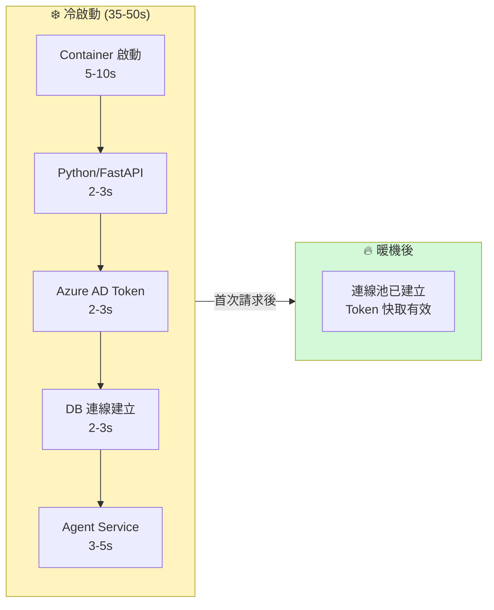

| 狀態 | TTFB | 端到端回應 | 說明 |
|---|---|---|---|
| ❄️ 冷啟動 | 35–50s | 40–50s | Container 從零啟動 |
| 🔥 暖機後 | ~1s | **~15-16s** | TTFB 僅含網路往返，實際回應需等 LLM 完成 |

> **備註**：暖機後 TTFB ~1s 是指 HTTP 連線建立到收到第一個 SSE event 的時間，不包含 LLM 處理。使用者感知的等待時間為端到端 ~15s。

### 1.2 暖機狀態的效能基線

> 以下所有分析與實驗均基於**暖機狀態**。

| 面向 | 基線數據 |
|---|---|
| 平均端到端回應時間 | **15.5s**（by-sheet）/ **15.8s**（hybrid） |
| 回答正確率 | 100%（20 題全對） |
| 測試檔案類型 | XLSX, PDF, DOCX |

---

## 2. Latency Breakdown Analysis

### 2.1 各階段時間分佈

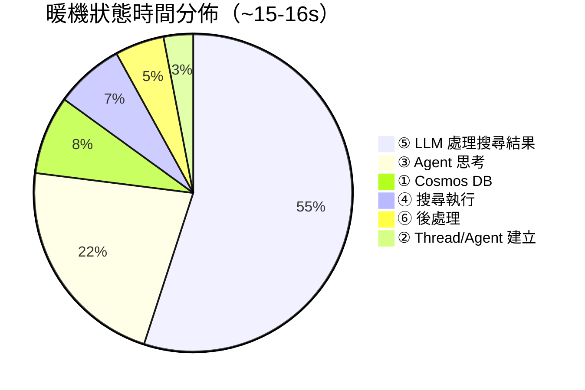

| 階段 | 暖機耗時 | 佔比 | 狀態 |
|---|---|---|---|
| ① Cosmos DB 讀取/建立 | ~1-2s | 8% | ✅ 可優化 |
| ② Thread/Agent 建立 | ~0.5s | 3% | ✅ 已精簡 |
| ③ Agent 思考＋選擇工具 | ~3-4s | 22% | ⚠️ 架構限制 |
| ④ search_knowledge_base | ~1-1.5s | 7% | ✅ 已不錯 |
| **⑤ LLM 處理搜尋結果** | **~8-10s** | **55%** | **❌ 最大瓶頸** |
| ⑥ 後處理＋DB 更新 | ~1s | 5% | ✅ 可優化 |

### 2.2 瓶頸根因：Excel 超大 Chunk

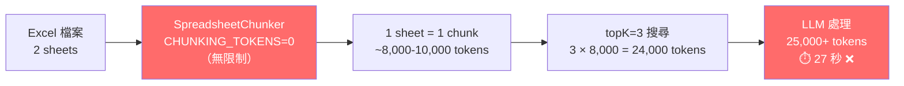

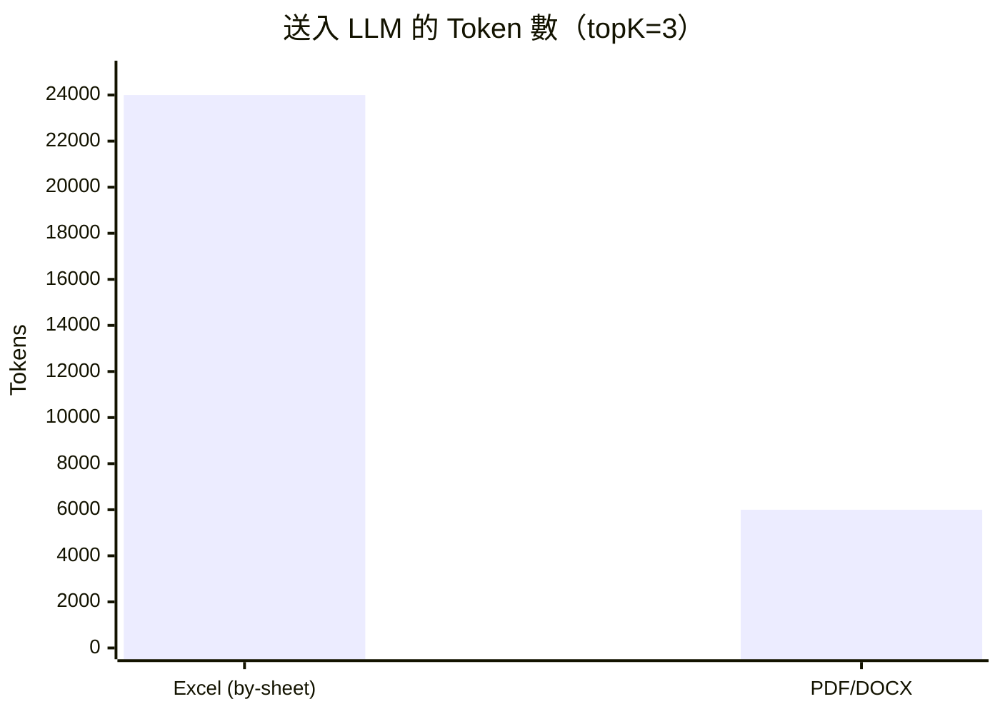

| | Excel (by-sheet) | PDF / DOCX |
|---|---|---|
| Chunk 大小 | ~8,000–10,000 tokens | ~2,000 tokens |
| 3 chunks 合計 | **~24,000 tokens** | **~6,000 tokens** |
| LLM 處理時間 | **~27s** | **~8-12s** |

### 2.3 檔案類型影響

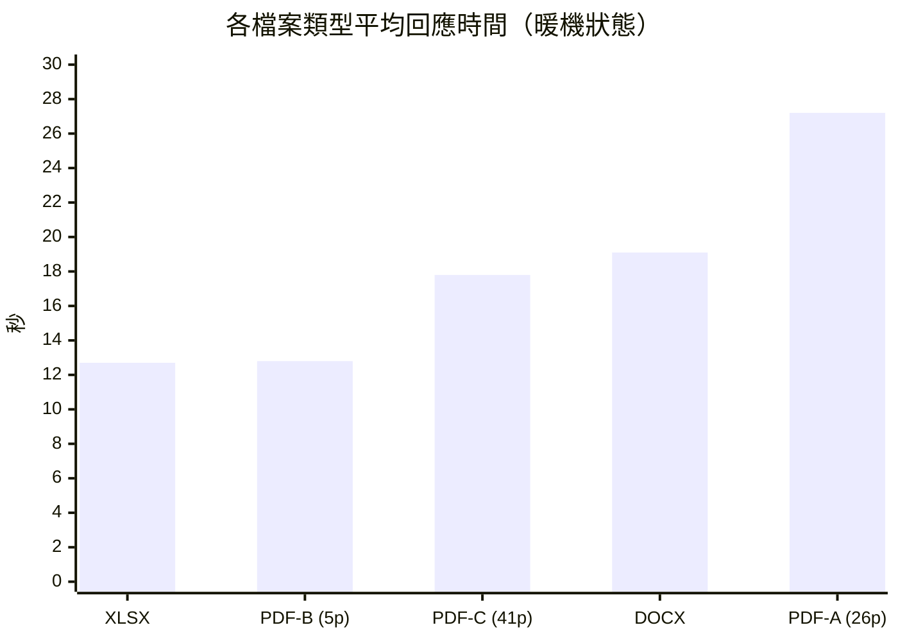

> **檔案類型影響不大**。速度差異來自 chunk 資訊密度 + LLM 搜尋次數 + 總 token 數。

### 2.4 Prompt 長度影響

| 模式 | Token 數 | 平均時間 | 勝出次數 |
|---|---|---|---|
| Standard | ~800-1000 | 17.9s | 5/10 |
| Lite | ~350-450 | 18.4s | 5/10 |
| **差異** | ~450 tokens | **0.4s (2%)** | **平手** |

> **Prompt 長度不是瓶頸**。精簡 prompt 的價值在省 token 成本，不在速度。

### 2.5 Excel Chunking 策略比較（XLSX 專項）

> 以下實驗**僅針對 XLSX 檔案**（林口恩典大樓A棟時程表），比較三種 chunking 策略對回應時間與品質的影響。

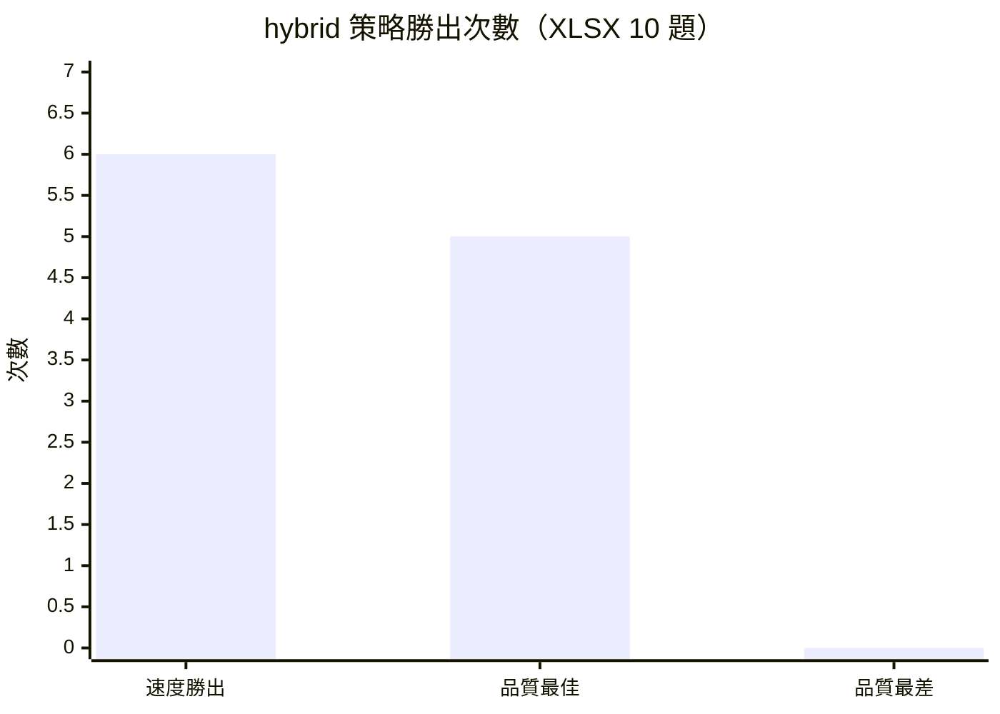

| 指標 | by-sheet | by-row | hybrid ⭐ |
|---|---|---|---|
| 平均時間 | 15.5s | 15.8s | 15.8s |
| 速度勝出 | 2/10 | 2/10 | **6/10** |
| 品質最佳 | 4/10 | 1/10 | **5/10** |
| 品質最差 | 1/10 | 2/10 | **0/10** ✅ |

> **Hybrid = 速度與品質的最佳平衡**，從未回答錯誤。

---

## 3. Optimization Options

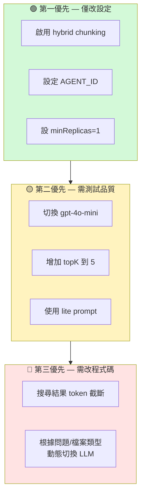

| 優先級 | 方案 | 預期速度影響 | 品質影響 | 成本影響 |
|---|---|---|---|---|
| 🟢 P1 | **啟用 hybrid chunking** | ≈ 相當 | ⬆️ 最佳 | ≈ 持平 |
| 🟢 P1 | **設定 AGENT_ID** | ⬆️ 省 ~1.5s | ≈ 不變 | ≈ 持平 |
| 🟢 P1 | **minReplicas=1** | ⬆️ 消除冷啟動 | ≈ 不變 | ⬆️ +$30-50/月 |
| 🟡 P2 | **切換 gpt-4o-mini** | ⬆️⬆️ 快 50-60% | ⬇️ 略降 | ⬇️ 大幅降低 |
| 🟡 P2 | **增加 topK=5** | ⬇️ 略慢 | ⬆️ 更完整 | ⬆️ 略增 |
| 🟡 P2 | **Lite prompt** | ≈ 無差異 | ≈ 不變 | ⬇️ 省 ~450 tokens/次 |
| 🔴 P3 | **搜尋結果 token 截斷** | ⬆️ 限制大 chunk | ⬇️ 可能截斷 | ≈ 持平 |
| 🔴 P3 | **動態切換 LLM** | ⬆️⬆️ 簡單問題極快 | ⬆️ 適材適用 | ⬇️ 降低 |

> **動態切換 LLM**：根據問題複雜度及檔案類型，自動選用 GPT-5.2（複雜）或 GPT-4o-mini（簡單）。需修改 Orchestrator 路由邏輯、Agent 建立流程、prompt 策略等，**改動範圍大**。

---

## 4. Trade-offs Discussion

### 4.1 Latency vs Accuracy

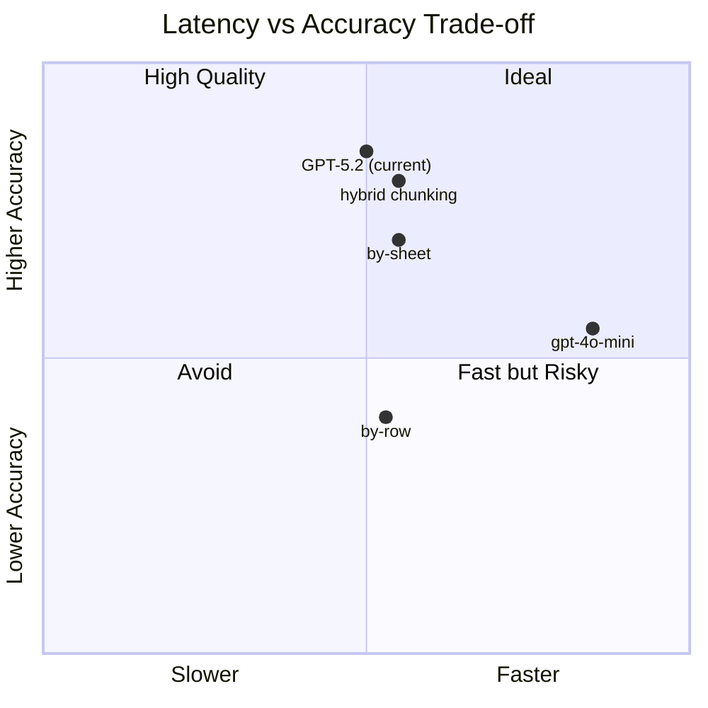

| 方案 | 速度 | 準確率 | 取捨 |
|---|---|---|---|
| **hybrid chunking** | 15.8s | 0 次品質最差 | ✅ 速度不犧牲、品質最穩定 |
| **by-sheet** | 15.5s | 1 次品質最差 | 全表掃描強，單行查詢弱 |
| **by-row** | 15.8s | 2 次品質最差 | 單行精準，但缺乏全局視角 |
| **gpt-4o-mini** | ~6-8s（預估）| 未測試 | ⚠️ 速度大幅提升，但複雜問題品質風險 |

**Chunking 策略詳細品質比較（10 題）：**

| 問題 | by-sheet | by-row | hybrid |
|---|---|---|---|
| Q2（27F 設計單位）| ❌ 找不到 | ✅ | ✅ |
| Q3（柏成設計樓層）| ✅ 完整 | ⚠️ 僅 30F | ⚠️ 僅 30F |
| Q4（用途變更）| ✅ 完整列出 | ❌ 僅表頭 | ❌ 僅表頭 |
| Q8（未定樓層）| ✅ 完整列出 | ❌ 搜不到 | ✅ 完整列出 |
| Q10（全棟概述）| ✅ 完整 | ⚠️ 片段 | ⚠️ 片段 |

> **結論**：hybrid 在單行精確 + 條件篩選表現最好、全表問題靠 by-sheet chunk 兜底；  
> gpt-4o-mini 可大幅提速但需先驗證複雜問題品質。

---

### 4.2 Latency vs Cost

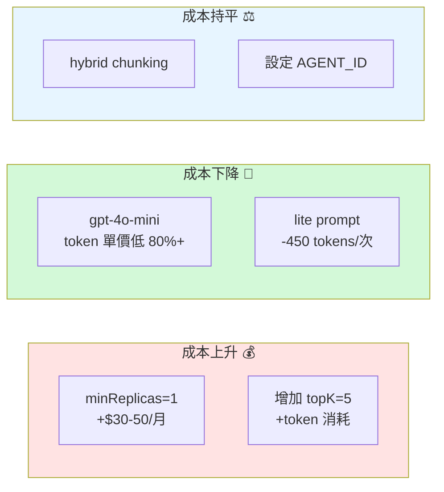

| 方案 | 速度效果 | 月成本變化 | 備註 |
|---|---|---|---|
| **minReplicas=1** | 消除 35-50s 冷啟動 | **+$30-50** | 依使用頻率決定是否值得 |
| **gpt-4o-mini** | 快 50-60% | **大幅↓** | token 單價約 gpt-4.1 的 1/5 |
| **lite prompt** | 無差異（+0.4s） | **-$5-10/月**（估） | 每次省 ~450 input tokens |
| **hybrid chunking** | 同等速度 | **持平** | 無額外成本，品質最佳 |
| **AGENT_ID** | 省 ~1.5s | **持平** | 預建立 Agent 即可 |
| **topK=5** | 略慢 | **略↑** | 更多 chunks → 更多 tokens |

> **最佳 CP 值**：hybrid chunking + AGENT_ID（零成本、品質上升）  
> **最大速度提升**：gpt-4o-mini（快 50%+ 且成本更低，但需驗證品質）

---

### 4.3 Latency vs Stability

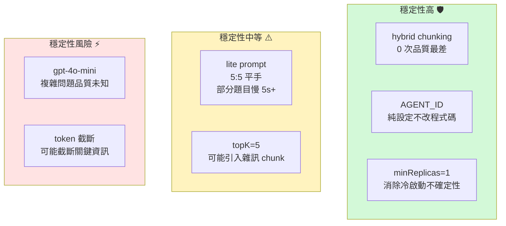

| 方案 | 回應時間波動 | 品質穩定性 | 部署風險 |
|---|---|---|---|
| **hybrid chunking** | 低（9.8-31.2s） | ✅ 最穩定 | 低（僅改 index） |
| **AGENT_ID** | 低 | ✅ 不變 | 低（僅改設定） |
| **minReplicas=1** | ⬇️ 消除冷啟動波動 | ✅ 不變 | 低 |
| **lite prompt** | ⚠️ 個別題差異 ±5s | ✅ 不影響 | 低 |
| **gpt-4o-mini** | 低（預期更快） | ⚠️ 未驗證 | 中（需 A/B 測試） |
| **token 截斷** | 低 | ⚠️ 可能截斷 | 中（需調參數） |
| **動態切換 LLM** | 低 | ✅ 適材適用 | 高（改動範圍大） |

> **穩定性最佳組合**：hybrid chunking + AGENT_ID + minReplicas=1  
> 零程式碼改動、零品質風險、消除冷啟動不確定性。

---

## 結論

### 暖機狀態端到端回應 ~15s 是否可接受？

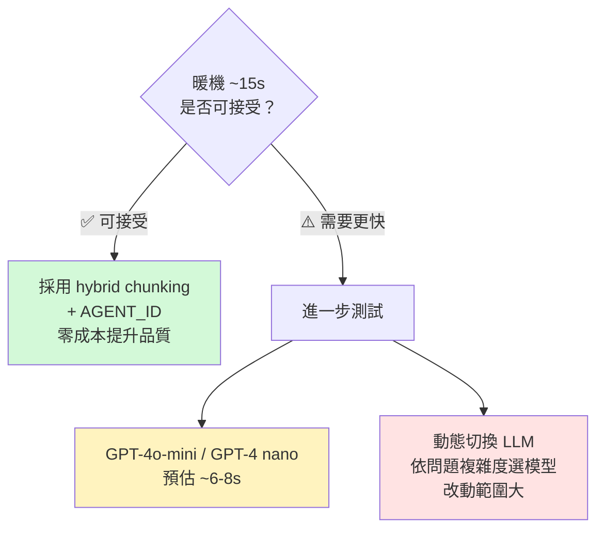

| 建議 | 說明 |
|---|---|
| ✅ **立即執行** | 採用 **hybrid chunking**，在**不影響回應時間**的前提下**提升回答正確率**（0 次品質最差） |
| ✅ **立即執行** | 設定 **AGENT_ID**，每次省 ~1.5s，零風險 |
| 🔍 **若需再提速** | 測試 **GPT-4o-mini** 或 **GPT-4 nano**，預估可將回應時間壓到 ~6-8s，但需驗證複雜問題品質 |
| 🔍 **長期方案** | 實作**動態 LLM 切換**（依問題類型/檔案類型自動選模型），可兼顧速度與品質，但修改範圍大 |

> **核心結論**：  
> 1. **Hybrid chunking 是當前最佳選擇** — 零成本、零風險、品質提升、速度不變  
> 2. **~15s 若仍不足**，下一步應測試 GPT-4 nano 或動態切換 LLM 方案  
> 3. **冷啟動 35-50s** 可透過 `minReplicas=1`（+$30-50/月）完全消除
